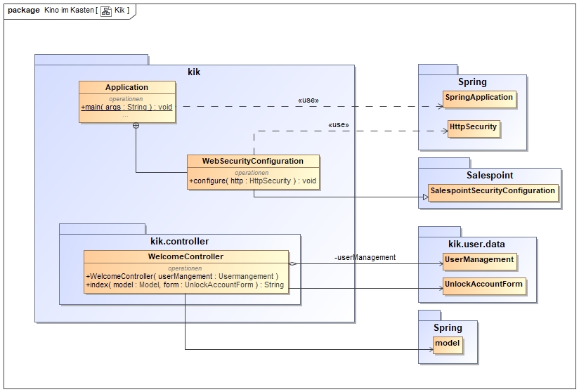

= Entwicklerdokumentation
:toc:
:toclevels: 2
:showtitle:
:homepage: https://github.com/st-tu-dresden-praktikum/swt19w4
:project_name: SWP 2019/20 - Kino im Kasten
:version: 0.0.2

== Einführung und Ziele

=== Aufgabenstellung

Das studentische "__Kino im Kasten__" benötigt ein Tool zur *Organisation des Programmablaufs*. Das Tool soll Funktionen zur Buchung und Abrechnung von Filmen, Erstellung von Dienstplänen, sowie eine Schnittstelle zur Öffentlichkeitsarbeit beinhalten.

Das Kino betreibt bereits einen Server, auf dem die Software installiert werden kann. Die Hauptfunktionen sollen von da aus per Web-Interface für berechtigte Benutzer zur Verfügung stehen. Eine REST-API soll den lesenden Zugriff auf bestimmte Informationen ermöglichen. Webinterface und API sollten über verschiedene Ports erreichbar sein. Zur Datenhaltung steht eine MySQL-Datenbank bereit.

Für die Erstellung eines solchen Tools ist nun im Software-Praktikum der Technischen Universität Dresden die **Gruppe 4 - Extern** zuständig. Sie analysiert, entwirft und implementiert die Web-Applikation. Im Folgenden sind die wichtigsten Kriterien gelistet, die essentiell für die Anwendung sind.

=== Qualitätsanforderungen

===== Usability (8 / 10)

Da die Benutzer der WebApplikation auch Personen ohne Fachwissen sein werden, muss die Benutzerfreundlichkeit stark ausgeprägt sein. Deswegen soll die GUI selbsterklärend und die Anzahl der Funktionen nicht überladen sein. Das Bootstrap Framework sichert daher nicht nur die Funktionalität auf mobilen Endgeräten ab, sondern auch eine übersichtliche Gestaltung.

===== Functionality (8 / 10)

Die dem Kunden zur Verfügung stehenden Funktionen der Applikation werden genau auf dessen Wünsche abgestimmt. Zur Gewährleistung dieser findet ein Abnahmetest am Ende des Entwicklungsprozesses statt.

===== Maintainability & Changeability (7 / 10)

Das System muss von den Entwicklern des Teams vom "__Kino im Kasten__" weitergeführt, ausgebaut und debuggt werden können. Dazu gibt es eine umfassende Code-Dokumentation mit JavaDoc.

===== Dependability (6.5 / 10)

Die Zuverlässigkeit des Systems ist wichtig. Eine umfangreiche Test-Suite mit __JUnit 4__ wird deswegen Verwendung finden, sodass mit UnitTests und IntegrationsTest ein korrekter Programmablauf getestet wird.

===== Security (5 / 10)

Da mit Benutzerdaten umgegangen wird, wird ein Mindestmaß an Sicherheit  garantieren. Dieses wird mit __Spring-Security__ umgesetzt. Ersthafte DOS-Angriffe sind jedoch nicht zu erwarten.

===== Transmissibility (4 / 10)

Die Übertragbarkeit ist durch __Maven__ / __Gradle__ insofern gewährleistet, als das das Programm als `.jar` ausgeliefert wird.

===== Code-Efficiency (3.5 / 10)

Das Laufzeitverhalten der Anwendung ist normal und dem von Code für WebApplications auf der JVM entsprechend. Es gibt damit keine besonderen Leistungsmerkmale bezüglich des Laufzeitverhaltens.

== Randbedingungen

=== Hardware-Spezifikationen

Die Hardware, die benötigt wird, um die von den studentischen Entwicklern entworfene Software zu verwendet, gliedert sich grob in Anforderungen an den Nutzer und an den Host.

Die Benutzer der Anwendung können diese entweder mobil oder an einem PC verwendet. Dafür ist ein entsprechendes mobiles Endgerät mit Touchscreen und minimaler Auflösung von 720p (HD) notwendig, auf dem Computer wird von der notwendigen Peripherie ausgegangen. Systemanforderungen an diese Computer sind so anzusetzen, dass sie die Ausführung der unten genannten Browser ermöglichen.

Das System wird in einer virtualisierten Umgebung verwendet werden. Die minimalen Systemanforderungen für eine aktuelle Java 11 Anwendung 2019 / 2020 werden erfüllt. Der Server des "__Kino im Kasten__" erfüllt folgende Systemspezifikationen:

Der Server ist erreichbar unter _swt.kino-im-kasten.de_. Virtualisiert wird ein Debian 10 Buster. Die CPU ist ein Dual Core vCore CPU auf 2399 MHz mit 1024 MB RAM, 10GiB SSD und 1 GiB networking.

=== Software-Spezifikationen

Die Software wird mit OpenJDK 11, also Java 11 (zu diesem Zeitpunkt die neuste LTS von Java) entwickelt.

Um die WebAnwendung im Browser auszuführen, werden folgende Browser oder neuere Versionen eben jener unterstützt

* Firefox Browser 70.0 [Mozilla]
* Chrome 78.0.3904.70 [Google]
* Edge 44.18362.387.0 [Microsoft]

Des Weiteren sollte _JavaScript_ im Browser aktiviert sein, um mögliche _JQuery_ Bibliotheken für _Bootstrap_ zu unterstützen.

=== Vorgaben zur Produktnutzung

Die Anwendung wird den von Arbeitnehmern des "__Kino im Kasten__" verwendet werden, um den Kinobetrieb und die Verwaltung des Kinos zu organisieren. Dafür wird die WebAnwendung auf einem Server des "__Kino im Kasten__" gehostet, um den Mitarbeitern zur Verfügung zu stehen.

Bei der Überwiegenden Mehrheit der Nutzer kann nicht von geschultem Fachpersonal ausgegangen werden. Alle Eingabemasken sollten also selbsterklärend gestaltet sein, sowie im Falle von Falscheingaben aussagekräftige Fehlermeldungen anzeigen. Insbesondere darf inkorrektes Bedienen nicht zum Absturz des Systems oder dem Ausfall wesentlicher Funktionen führen.

Die Anwendung sollte so wenig wie möglich Wartungsarbeiten benötigen. Alle Daten werden in einer persistenten Datenbank gespeichert (MySQL).

== Kontextabgrenzung

[[Kontextdiagramm]]

== Lösungsstrategie

=== Erfüllung der Qualitätsziele

// * ISO 9126

[options="header", cols="2, 8"]
|=== 

| Qualitätsmerkmal
| Qualitätsziel & Lösungsansatz

| Usability
a|

**Verständlichkeit**

****

* Die GUI ist direkt an die Ansprüche der Benutzer angepasst, sodass es stets die Möglichkeit gibt, zu Erfahren, wie die Anwendung an dieser Stelle funktioniert.
* Die GUI versucht stets, nicht überladen zu sein, um eine einfache Übersicht zu garantieren. Sie ist damit selbsterklärend.

****

**Erlernbarkeit**

****

Mit Hilfe von _How-To_ Seiten soll allen Benutzer des Systems die Möglichkeit geboten werdem, die ANwendung korrekt navigieren und benutzen zu können.

****

**Bedienbarkeit**

****

Durch die Bereitstellung als WebApp kann die Anwendung in fast jedem modernen Browser Verwendung finden.

****

| Functionality
a|

**Sicherheit**

****

* Für die Verschlüsselung von Passwörtern wird auf `Spring.Security` zurückgegriffen, um das Hashing und die sichere Speicherung der Passwörter zu garantieren

* Die Website ist durch ein initiales LogIn geschützt, sodass nicht-authentifizierte Benutzer keinen Zugriff auf den Inhalt der Website haben 

****

**Angemessenheit**

****

* Die verwendeten Daten sind direkt an die Wünsche des Kunden angepasst, sodass es an keiner Stelle zu unnützer Verwendung kommt

* Durch stetige Rücksprache mit dem Kunden soll am Ende eine Anwendung entstehen, die so maßgeschneidert für den Kunden ist 

****

| Maintainability & Changeability
a| 

**Analysierbarkeit und Modifizierbarkeit**

****

* Der Sourcecode wird durch __JavaDoc__ dokumentiert, sodass Entwickler, die den Code später weiterentwickeln oder verändern, eine gute Übersicht über das Geschehen erhalten.

* Die Masse an Dokumentation, die während des Praktikums entsteht, gibt einen guten Überblick über das Interne der Anwendung.

****

**Anpassbarkeit**

****

Der Sourcecode ist von jedem Entwickler des "__Kino im Kasten__" frei einsehbar und modifizierbar, sofern dies notwendig sein sollte.

****

**Stabilität**

****

Um eine stabile Anwendung zu garantieren, wird der Sourcecode durch Unit-Tests abgedeckt werden. __JUnit 4__ wird daher Verwendung finden, um eine Code-Coverage von mindestens **70%** zu garantieren

****

**Installierbarkeit**

****

Das Programm wird als `.jar` ausgeliefert werden, und damit auf allen System laufen, die eine Java 11 `.jar`-Datei ausführen können, a.k.a auf allen geräten mit modernem Java.

****

| Dependability
a|

**Reife**

****

Durch verschienden Phasen der Softwareentwicklung wird sichergestellt, dass die fertige Software die notwendige Reife zur Auslieferung und Verwendung in der Produktion findet.

****

**Fehlertoleranz**

****

* Die Software soll gegenüber _Human-Errors_ entsprechende Vorkehrungen, also bestimmte Business-Logic beinhalten, sodass bestimmte Fehler von vornehinein ausgeschlossen werden können. 
* Die Software soll so konstruiert werden, dass Fehler innerhalb der Programmlogik nicht zu Komplettausfällen führen.

****

| Effizienz
a|

**Code-Efficiency**

****

Die Anwendung wird zur Auslieferung mit __Maven__ im __clean__-mode, das heißt mit Code-Optimierung kompiliert.

****

|===

=== Softwarearchitektur

// TODO TLA hier einfügen

[[TopLevelDiagram]]

[[ClientServerModel]]

=== Entwurfsentscheidungen

==== Verwendete Muster

- Spring MVC

==== Persistenz

- Die Anwendung nutzt Spring-Repositorys, welche auf eine SQL-Datenbank zugreifen.

==== Benutzeroberfläche

==== Verwendung externer Frameworks

[options="header", cols="1,3,3"]
|===
|Externe Klasse |Pfad der externen Klasse |Verwendet von (Klasse der eigenen Anwendung)
|Spring Framework | org.springframework.* | Alle
|Salespoint Framework | org.salespointframework.* | kik.user.*
|Templateengine | org.thymeleaf.TemplateEngine | Alle
|IOUtils | org.apache.commons.io.IOUtils | PdfGenerator
|iTextRenderer | org.xhtmlrenderer.pdf.ITextRenderer | PdfGenerator
|Assert | com.mysema.commons.lang.Assert | Diverse Managementklassen und Controller in kik.event und kik.movie
|JQuery | https://cdnjs.cloudflare.com/ajax/libs/jquery/3.4.1/jquery.min.js | Bootstrap
|Bootstrap | https://cdnjs.cloudflare.com/ajax/libs/twitter-bootstrap/4.3.1/js/bootstrap.bundle.min.js | GUI
|ChartJS | https://cdnjs.cloudflare.com/ajax/libs/Chart.js/2.5.0/Chart.min.js | Overview

|===

== Bausteinsicht

=== Kino im Kasten

[[KiK]]

[options="header"]
|=== 
|Klasse/Enumeration      |Description
|Application             |Ist die zentrale Klasse, in der Spring konfiguriert wird und die Anwendung started. 
|WelcomeController       |Ist eine Konfigurationsklasse, in der `/login` direkt auf `login.html` verweist.
|WebSecurityConfiguration|Ist eine Konfigurationsklasse, in der eine Grundsicherheit hergestellt und login/logout optionen festgelegt werden. 
|===

=== Buchung

[[Buchung]]

[options="header"]
|=== 
|Klasse/Enumeration         |Description
|BookingGetController       |Ein Spring MVC-Controller, welcher GET Anfragen zu `Booking` entgegennimmt.
|BookingPostController      |Ein Spring MVC-Controller, welcher POST Anfragen zu `Booking` entgegennimmt.
|BookingManagement          |Service Klasse um Buchungen zu verwalten.
|BookingFilter              |Eine Klasse, welche Buchungen nach Attributen filtert.
|BookingInitializer         |Klasse zum erstellen und editieren von Buchungen.
|BookingValidation          |Klasse zum überprüfen von Nutzereingaben.
|Booking                    |Eine Klasse, welche eine Buchung mit ihren Attributen beschreibt.
|BookingState               |Repräsentiert den Zustand einer echten Buchung. 
|BookingForm                |Speichert die Nutzereingaben für Buchungen zwischen.
|Conditions                 |Enthält die Konditionen einer Buchung.
|BookingRepository          |Ein Repository-Interface um Buchungsobjekte zu verwalten.
|ConditionsConverter        |Konvertiert Konditionen zu einem String, um diesen als Attribut in einer Buchung zu speichern.
|SampleBookingInitializer   |Initialisiert Test-Buchungen.
|===

=== Veranstaltung

==== Controller

[[event_controller]]

[options="header"]
|=== 
|Klasse/Enumeration          |Description
|MovieEventPostController    |Ein Spring MVC-Controller, welcher POST Anfragen zu `Event` entgegennimmt.
|MovieEventGetController     |Ein Spring MVC-Controller, welcher GET Anfragen zu `Event` entgegennimmt.
|===

==== Management

[[event_management]]

[options="header"]
|=== 
|Klasse/Enumeration     |Description
|MovieEventValidation   |Eine Implementation des `Validator` Interfaces, um Nutzereingaben zu überprüfen.
|MovieEventManagement   |Service Klasse um Buchungen zu verwalten.
|MovieEventInitializer  |Formalisiert die Erstellung einer Filmveranstaltung.
|Check                  |Prüft ob ein Attribut Null ist.
|EventInitializer       |Formalisiert die Erstellung eines Events.
|EventManagement        |Service Klasse um Veranstaltungen zu verwalten.
|SampleEventInitializer |Eine Implementation des `DataInitializer` Interfaces, um Test-Veranstaltungen zu erstellen.
|EventFilter            |Eine Klasse, welche Veranstaltungen nach Attributen filtert.
|===

==== Data

[[event_data]]

[options="header"]
|=== 
|Klasse/Enumeration     |Description
|Event                  |Eine Klasse, welche eine Veranstaltung mit ihren Attributen beschreibt.
|EventData              |Ein Model, welches die Daten enthält, welche alle Veranstaltungen gemeinsam haben.
|EventForm              |Speichert die Nutzereingaben für Veranstaltungen zwischen.
|EventRepository        |Ein Repository-Interface um Veranstaltungsobjekte zu verwalten.
|EventPlanningStatus    |Repräsentiert den Planungsstatus einer Veranstaltung.
|EventPublicity         |Repräsentiert die Öffentlichkeit einer Veranstaltung.
|EventType              |Repräsentiert den Veranstaltungstyp.
|Tickets                |Enthält die Ticketzahlen einer Veranstaltung und führt Berechnungen aus.
|TicketsForm            |Speichert die Nutzereingaben für Tickets zwischen.
|MovieEventData         |Enthält alle Informationen um ein MovieEvent zu erstellen.
|MovieEvent             |Basierend auf dem Event, stellt dies eine Filmveranstaltung dar.
|MovieEventRepository   |Verwaltet/Enthält alle MovieEvent's
|MovieEventForm         |Speichert die Nutzerengaben für MovieEvents zwischen.
|SpecialEventRepository |Ein Repository-Interface um Veranstaltungsobjekte zu verwalten.
|SpecialEventData       |Enthält alle Informationen um ein SpecialEvent zu erstellen.
|SpecialEvent           |Eine Klasse, welche eine Spezialveranstaltung mit ihren Attributen beschreibt.
|SpecialEventForm       |Speichert die Nutzereingaben für Spezialveranstaltungen zwischen.
|TicketValidator        |Eine Implementation des `Validator` Interfaces, um Nutzereingaben zu überprüfen.
|===

=== Film

[[Film]]

[options="header"]
|=== 
|Klasse/Enumeration |Description
|MovieGetController |Ein Spring MVC-Controller, welcher GET Anfragen zu `Movie` entgegennimmt.
|MoviePostController|Ein Spring MVC-Controller, welcher POST Anfragen zu `Movie` entgegennimmt.
|MovieManagement    |Service Klasse um Filme zu verwalten. 
|MovieValidation    |Eine Implementation des `Validator` Interfaces, um Nutzereingaben zu überprüfen.
|MovieFilter        |Eine Klasse, welche Filme nach Attributen filtert.
|Movie              |Eine Klasse, welche einen Film mit seinen Attributen beschreibt.
|MovieRepository    |Ein Repository-Interface um Filmobjekte zu verwalten.
|MovieForm          |Speichert die Nutzerengaben für die Erstellung und Bearbeitung von Filmen zwischen.
|MovieInitializer   |Eine Implementation des `DataInitializer` Interfaces, um Test-Filme zu erstellen.
|===

=== Verleiher

[[Verleiher]]

[options="header"]
|=== 
|Klasse/Enumeration         |Description
|DistributorGetController   |Ein Spring MVC-Controller, welcher GET Anfragen zu `Distributor` entgegennimmt.
|DistributorPostController  |Ein Spring MVC-Controller, welcher Anfragen zu `Distributor` entgegennimmt.
|DistributorManagement      |Service Klasse um Verleiher und deren Kontaktpersonen zu verwalten.
|ContactPersonValidator     |Eine Implementation des `Validator` Interfaces, um Nutzereingaben zu überprüfen.
|DuplicateException         |Ein Fehler, wenn ein Verleiher bereits existiert.
|DistributorInitializer     |Eine Implementation des `DataInitializer` Interfaces, um Test-Verleiher und Kontaktpersonen zu erstellen.
|ContactPersonValidator     |Eine Implementation des `Validator` Interfaces, um Nutzereingaben zu überprüfen.
|Distributor                |ine Klasse, welche einen Verleiher mit seinen Attributen beschreibt.
|DistributorForm            |Speichert die Nutzerengaben für die Erstellung und Bearbeitung eines Verleiher zwischen.
|ContactPerson              |Eine Klasse, welche eine Kontaktperson eines Verleihers mit ihren Attributen beschreibt.
|ContactPersonForm          |Speichert die Nutzerengaben für die Erstellung und Bearbeitung einer Kontaktperson zwischen.
|DistributorRepository      |Ein Repository-Interface um Verleiher zu verwalten.
|ContactPersonRepository    |Ein Repository-Interface um Kontaktpersonen von Verleihern zu verwalten.
|===

=== Dienstplan

[[Dienstplan]]

[options="header"]
|=== 
|Klasse/Enumeration     |Description
|DutyplanPostController |Ein Spring MVC-Controller, welcher POST Anfragen zu `Dutyplans` entgegennimmt.
|DutyplanGetController  |Ein Spring MVC-Controller, welcher GET Anfragen zu `Dutyplans` entgegennimmt.
|DutyplanManagement     |Service Klasse um Dienstpläne zu verwalten.
|JobManagement          |Service Klasse um Aufgaben von Veranstaltungen zu verwalten.
|AssignForm             |Speichert Nutzereingaben für die Zuweisung einer Person zu einem Dienstplan zwischen.
|Dutyplan               |Eine Klasse, welche einen Dienstplan mit seinen Attributen beschreibt.
|DutyplanRepository     |Ein Repository-Interface um Dienstpläne zu verwalten.
|DutyplanInitializer    |Eine Implementation des `DataInitializer` Interfaces, um Test-Dienstpläne zu erstellen.
|Job                    |Repräsentiert eine Aufgabe während einer Veranstaltung
|JobForm                |Speichert die Nutzereingaben für die Erstellung eines neues Jobs zwischen.
|JobRepository          |Ein Repository-Interface um Jobs zu verwalten.
|===

=== Nutzer

==== Controller

[[user_controller]]

[options="header"]
|=== 
|Klasse/Enumeration |Description
|UserGetController  |Ein Spring MVC-Controller, welcher GET Anfragen zu `User` entgegennimmt.
|UserPostController |Ein Spring MVC-Controller, welcher POST Anfragen zu `User` entgegennimmt.
|===

==== Management

[[user_management]]

[options="header"]
|=== 
|Klasse/Enumeration  |Description
|UserValidation      |Eine Implementation des `Validator` Interfaces, um Nutzereingaben zu überprüfen.
|UserManagement      |Service Klasse um Nutzer zu verwalten und existierenden Nutzern zugriff auf das System zu gewähren. 
|AccessRoleManagement|Service Klasse um Nutzerrollen zu verwalten.
|UserTypeManagement  |Service Klasse um Nutzer zu verwalten.
|===

==== Management

[[user_data]]

[options="header"]
|=== 
|Klasse/Enumeration         |Description
|User                       |Eine Klasse, welche einen Benutzer mit seinen Attributen beschreibt.
|UserRepository             |Eine Datenbank, welche Nutzer verwaltet/beinhaltet.
|UserTypeRepository         |Eine Datenbank, welche Nutzer verwaltet/beinhaltet.
|UserType                   |Legt die Rollen eines Nutzers Fest.
|AccessRoleRepository       |Eine Datenbank, welche AccessRoles verwaltet/beinhaltet.
|AccessRole                 |Entspricht einer Rolle von Salespoint.
|AccessRoleEnum             |Repräsentiert die verschiedenen Rollen von Nutzern im System.
|GreatUserInitializer       |Eine Implementation des `DataInitializer` Interfaces, um Test-Nutzer zu erstellen.
|ChangePasswordAdminForm    |Speichert die Nutzerengaben für die Bearbeitung eines Nutzers zwischen.
|ChangeUserNameForm         |Speichert die Nutzerengaben für die Bearbeitung eines Nutzers zwischen.
|ChangeUserTypeOfUserForm   |Speichert die Nutzerengaben für die Bearbeitung eines Nutzers zwischen.
|CreateNewUserForm          |Speichert die Nutzerengaben für die Erstellungeines Nutzers zwischen.
|ChangePasswordForm         |Speichert die Nutzerengaben für die Bearbeitung eines Nutzers zwischen.
|UnlockAccountForm          |Speichert die Nutzerengaben für die Bearbeitung eines Nutzers zwischen.
|===

=== Bild

[[Bild]]

[options="header"]
|=== 
|Klasse/Enumeration     |Description
|Picture                |Repräsentiert ein Filmplakat.
|PictureRepository      |Eine Datenbank, welche Pictures verwaltet/beinhaltet.
|PitureInitializer      |Eine Implementation des `DataInitializer` Interfaces, um Test-Bilder zu erstellen.
|PictureGetController   |Ein Spring MVC-Controller, welcher GET Anfragen zu `Picture` entgegennimmt.
|===

=== Pdf

[[Pdf]]

[options="header"]
|=== 
|Klasse/Enumeration |Description
|PdfGenerator       |Erstellt aus Buchungsdaten eine Pdf Datei
|===

=== Rest

[[Rest]]

[options="header"]
|=== 
|Klasse/Enumeration |Description
|RestController     |Ein Spring MVC-Controller, welcher GET Anfragen entgegennimmt und einen Json-String zurückgibt.
|RestManagement     |Service Klasse um Dienstpläne zu verwalten.
|RestDutyplan       |Enthält ausgewählte `Dutyplan` Daten, welche zu Json konvertiert werden.
|RestJob            |Enthält ausgewählte `Job` Daten, welche zu Json konvertiert werden.
|RestEvent          |Enthält ausgewählte `Event` Daten, welche zu Json konvertiert werden.
|RestMovieEvent     |Enthält ausgewählte `Movie` Daten, welche zu Json konvertiert werden.
|===

=== Rückverfolgbarkeit zwischen Analyse- und Entwurfsmodell

[options="header"]
|===
|Klasse/Enumeration (Analysemodell) |Klasse/Enumeration (Entwurfsmodell)
|Cinema         |kik (keine eigene Klasse)
|Movie          |kik.movie.data.Movie
|Booking        |kik.booking.data.Booking
|Dutyplan       |kik.dutyplan.data.dutyplan.Dutyplan
|EventRole      |kik.dutyplan.data.job.Job
|Distributor    |kik.distributor.data.Distributor
|ContactPerson  |kik.distributor.data.ContactPerson
|BookingState   |kik.booking.data.BookingState
|Event          |kik.event.data..event.Event
|EventType      |kik.event.data.EventType
|User           |kik.user.data.user.User
|Orga           |kik.user.data.accessRole.AccessRole
|Admin          |kik.user.data.accessRole.AccessRole
|===

== Laufzeitsicht

=== Nutzerverwaltung

=== Film

=== Verleiher

=== Buchung

=== Veranstaltung

=== Dienstplan

=== Übersicht

=== API

=== Beispielhafter Programmdurchlauf

== Technische Schulden

|===
| Qualitätsziel | Ziel | Erreicht | Bemerkung

| Usability
| 8/10
| 8/10
| Es wurde sich stark bemüht, eine selbsterklärende Benutzeroberfläche zu erstellen und die Abläufe so einfach wie möglich zu gestalten. 

| Functionality
| 8/10
| 9/10
| Neben den Muss-Kriterien wurden einige zusätzliche Wünsche des Kunden erfüllt (z.B Mehrsprachigkeit).

| Maintainability & Changeability
| 7/10
| 9/10
| Die Abdeckung der JavaDoc beträgt fast 100%.

| Dependability
| 6.5/10
| 8/10
| Die Testabdeckung von über 83% sollte dies gewährleisten.

| Security
| 5/10
| 5/10
| Auch wenn die Passworterstellung per Regex nicht zu empfehlen ist, sollte die Anwendung durch Spring-Security gut genug geschützt sein.

| Transmissibility
| 4/10
| 4/10
| -

| Code-Efficiency
| 3.5/10
| 5/10
| -

|===

 

Nach Sonarqube weist unsere Software keine Mängel auf.
