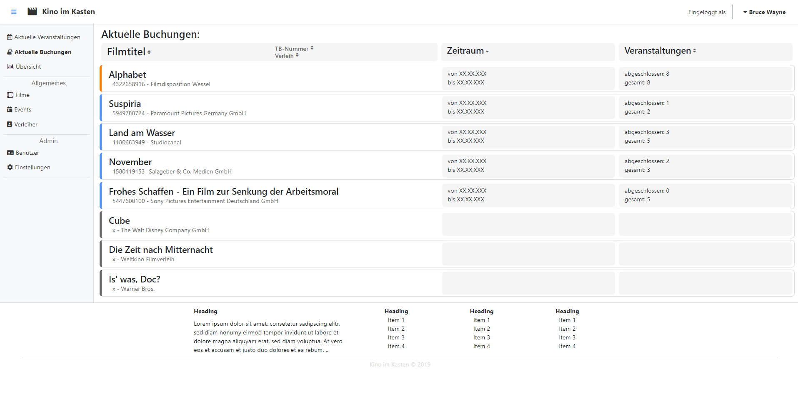

= Pflichtenheft - {project_name}
:toc:
:toclevels: 2
:showtitle:
:homepage: https://github.com/st-tu-dresden-praktikum/swt19w4
:project_name: SWP 2019/20 - Kino im Kasten
:version: 0.6.4

== Zusammenfassung

Dieses Dokument repräsentiert das Pflichtenheft des Projekts "SWP 2019 / 2020 - Kino im Kasten". Das Ziel dieses Dokuments ist es, einen Überblick über die entstehende Software zu geben. Damit dient es als Grundlage für die Kommunikation zwischen den Interessengruppen des Projekts, vor allem zwischen dem Kunden und dem Entwicklerteam.

Es wird also beschrieben, was das gewünschte System erfüllen muss und zum Teil, wie eine Lösung umgesetzt werden kann. Anhand dieser Übersicht kann also festgestellt werden, ob die definierte Software geliefert worden ist. Deshalb sollten diese Ziele überprüfbar sein, was Korrektheit, Konsistenz und Vollständigkeit fordert.

Änderungen sollten auf ein Minimum beschränkt werden, nachdem sich die Beteiligten einmal über den Inhalt geeinigt haben. Da sich jedoch die Anforderungen und Umstände während eines Projekts ständig ändern, sind Anpassungen zu erwarten und zu dokumentieren.

== Aufgabendefinition und Zielsetzung

Das studentische "__Kino im Kasten__" benötigt ein Tool zur *Organisation des Programmablaufs*. Das Tool soll Funktionen zur Buchung und Abrechnung von Filmen, Erstellung von Dienstplänen, sowie eine Schnittstelle zur Öffentlichkeitsarbeit beinhalten.

Das Kino betreibt bereits einen Server, auf dem die Software installiert werden kann. Die Hauptfunktionen sollen von da aus per Web-Interface für berechtigte Benutzer zur Verfügung stehen. Eine REST-API soll den lesenden Zugriff auf bestimmte Informationen ermöglichen. Webinterface und API sollten über verschiedene Ports erreichbar sein. Zur Datenhaltung steht eine MySQL-Datenbank bereit.

Für die Erstellung eines solchen Tools ist nun im Software-Praktikum der Technischen Universität Dresden die **Gruppe 4 - Extern** zuständig. Sie analysiert, entwirft und implementiert die Web-Applikation. Im Folgenden sind die wichtigsten Kriterien gelistet, die essentiell für die Anwendung sind.

Um den Kinobetrieb zu organisieren, müssen folgende Datenbestände erfasst und verarbeitet werden:

* **Buchungen**
  - Verknüpfung zu bestimmtem Film
  - Verknüpfung zu Verleih
  - TB-Nummer
  - abrechnungsrelevante Daten (Mindestgarantie, Prozentsatz, ...)
* **Filme**
  - Deutscher Titel
  - Originaltitel
  - Erscheinungsjahr
  - Regie
  - Beschreibungstext
  - etc.
* **Filmverleiher**
  - Adresse
  - Kontaktpersonen
* **Filmveranstaltungen**
  - Verknüpfung zu Buchung
  - Datum
  - Sprachversion
  - Werbetext
  - Abrechnung (Kartennummern, Eintrittspreis)
  - Typ
* **Sonderveranstaltungen**
  - Titel
  - Datum
  - Texte
  - Eintritt
* **Benutzerkonten**
  - Benutzername
  - Passwort-Hash
  - Rolle
* **Dienstplan**
  - Verknüpfung zu Veranstaltung
  - Verknüpfung zu Benutzern
  - Jobs (Vorführer, Kasse, ...)

Das Webinterface für Benutzer muss mindestens die folgenden Funktionen anbieten:

* Login
* Anzeigen und Bearbeiten der Filme
* Anzeige und Bearbeitung laufender Buchungen
* Abrechnen einer Buchung
* Download der Abrechnung als PDF
* Verwaltung von Sonderveranstaltungen
* Nutzerverwaltung
* Einträge in Dienstplan für alle geplanten Veranstaltungen
* Unterstützung von mobilen Endgeräten
* einfaches Rechtekonzept (Admin, Organistor, User)

Über die <<glossary, Rest-API>> müssen die folgenden Funktionen verfügbar sein:

* Anfrage aller öffentlicher Veranstaltungen
* Abfrage bestimmter Anzahl Veranstaltungen ab Zeitpunkt
* Abfrage Veranstaltungsdetails per ID
* Alle Zeiten als <<glossary, UTC-Timestamp>>
* Unicode für internationale Filmnamen
* Dienstplan-Einträge pro Film

Um die Software auf dem Server installieren zu können, muss sie in einem ausführbaren Format (z.B. `.jar`) vorliegen. Damit dieses bei Bedarf unkompliziert angepasst werden kann, muss dem Quellcode ein Build-Script (via Maven oder Gradle) beiliegen. Dieses sollte zur Robustheit Testfälle für die wichtigsten Funktionen (z.B. in Form von JUnit-Tests) beinhalten.

Da das Personal des "__Kino im Kasten__" aus Studenten besteht, kann nicht von geschultem Fachpersonal ausgegangen werden. Alle Eingabemasken sollten also selbsterklärend gestaltet sein, sowie im Falle von Falscheingaben aussagekräftige Fehlermeldungen anzeigen. Insbesondere darf inkorrektes Bedienen nicht zum Absturz des Systems oder dem Ausfall wesentlicher Funktionen führen.

Da die Software über viele Jahre eingesetzt werden soll, muss es ohne großen Aufwand möglich sein, Systemparameter zu verändern. (z.B. die regulären Kinopreise, das Template der Abrechnung, technische
Parameter wie Datenbank und Ports). Diese müssen nicht über das Webinterface gesteuert werden, sondern können z.B. beim Programmstart aus einem Config-File eingelesen werden.

== Produktnutzung

Die Anwendung für das "__Kino im Kasten__" ist eine sogenannte Web-Applikation, d.h. sie wird über einen Browser erreichbar sein und für alle Personen im Internet erreichbar sein. Über eine Website steht die komplette Funktionalität der Anwendung zur Verfügung. Daher soll das Programm in allen heute gängigen Browsern

  * Firefox Browser 70.0 [Mozilla]
  * Chrome 78.0.3904.70 [Google]
  * Edge 44.18362.387.0 [Microsoft]

sowohl auf PC wie auch auf mobilen Endgeräten einwandfrei funktionieren. Die Unterstützung von Opera 64.0.3417.73 [Opera] und Safari 13 [Apple] wird als Kann-Kriterium geführt.

Die Anwendung wird im Kontext der Administration und Verwaltung eines Kinos genutzt werden. Das studentisch betriebene "__Kino im Kasten__" benötigt eine aktuelle und effizientere, den neuen Standards angepasste Version zur Organisation des Kino-Betriebs.

Wichtige Rahmenbedingungen sind unter anderem Nicht-Haftbarkeit der Entwickler, die als Studenten die Applikation im Rahmen eines Moduls (INF-B-320) an der Universität entwickeln. Des Weiteren stehen die Studenten nicht in jeglicher Art und Weise in der Pflicht, eine DSGVO oder Allgemeine Datenschutzverordnung zu erstellen, selbst wenn mit persönlichen Daten gearbeitet werden sollte. Der Code wird weiter unter der von der Universität als <<glossary, Apache 2>> vorgegeben Lizenz verbreitet. Weiterhin wird keine Wartung durch die studentischen Entwickler in jeglicher Art und Weise gegeben.

== Interessensgruppen (Stakeholders)

=== Reale Interessengruppen

[options="header"]
[cols="1, 1, 3, 3"]
|===
| Person / Gruppe | Priorität | Begründetes Interesse | Ziele
| Kino im Kasten | 8 | Das studentische "__Kino im Kasten__" ist der Kunde des Projekts. Es tritt auch als juristische Person auf. | Verwendung der Applikation zur Verwaltung und Applikation des Kinobetriebs
| Interner Tutor*In | 7 |  Der / Die Tutor*In tritt als Betreuer*In des Projektes stellvertretend für die Universität auf. | Er / Sie überwacht und prüft den Fortschritt. Weiterhin ist Er / Sie maßgebend für die Bewertung verantwortlich.
| Entwickler der Kunden | 6 | Übernahme des Codes und der Wartung | Simple Erweiterbarkeit des Codes und einfaches Debugging
| Administratoren der Kunden | 4 | Systemadministratoren des "__Kino im Kastens__" | Verbesserte Übersicht über das System und einfachere Wartbarkeit
| Entwickler des Prototypen | 2 | Entwickler der Applikation | Erstellung eines Prototypen
|===

=== Juristische Personen

[options="header"]
[cols="1, 1, 3, 3"]
|===

| Person / Gruppe
| Priorität
| Begründetes Interesse
| Ziele

| Kino im Kasten
| 10
| Das studentische "__Kino im Kasten__" ist der Kunde des Projekts. Es tritt auch als reale Interessengruppe auf. | Verwendung der Applikation zur Verwaltung und Applikation des Kinobetriebs

| Technische Universität Dresden, Institut für Softwaretechnologie
| 7
| Die TUD stellt als Universität die Rahmenbedingungen zur Verfügung - d.h. die Gruppe aus Studenten, die Auswahl der Externen Kunden, die Tutoren und notwendige Infrastruktur. Sie ist damit maßgeblich bestimmend und beteiligt. | Hervorragende Kenntnisse der Studierenden im Bereich der Softwareentwicklung, in diesem externen Praktikum vor allem auch die Erfahrung der Realitätsnähe

|===

== Systemgrenze und Top-Level-Architektur

=== Kontextdiagramm

[[context_diagram]]
image:models/analysis/context_diagram.jpg[context diagram]

=== Top-Level-Architektur

[[top_level_diagram]]

== Anwendungsfälle

=== Akteure

[options="header"]
[cols="1,4"]
[[Akteure]]
|===
| Name            | Beschreibung
| Nichtautorisierter Benutzer | Repräsentiert alle nichtregistrierten und nicht authentifizierten Benutzer. Darf also dementsprechend nicht mit dem System interagieren.
| User                        | Repräsentiert alle registrierten und authentifizierten Nutzer. Darf mit dem System interagieren
| Organizer                   | Nutzer, welche organisatorische Aufgaben haben und Veranstaltungen leiten
| Admin                       | Benutzer mit uneingeschränkten Rechten
| Frontend (API)              | Repräsentiert Zugriffe auf die Daten des Systems zur Darstellung auf der Website des Kunden
|===

=== Überblick Anwendungsfalldiagramm

[[use_case_diagram]]
image:models/analysis/use_case_diagram.jpg[use-case-diagram]

=== Anwendungsfallbeschreibungen

==== Event

[cols="1h, 3"]
[[UCD0101]]
|===========================
|ID                        | **<<UCD0101>>**
|Name                      | create event
|Beschreibung              | Ein Organistor sollte eine Veranstaltung erstellen können.
|Akteure                   | Organistor
|Auslöser                  | Ein Organistor klickt auf "Veranstaltung erstellen", um eine neue Veranstaltung hinzuzufügen.
|Voraussetzung(en)        a| Der Organistor ist auf der Seite, welche alle Veranstaltungen anzeigt.
|Essentielle Schritte     a| 1. Organistor klickt auf "Veranstaltung erstellen"
2. Er trägt alle Daten in eine Form ein
3. Er bestätigt sie durch einen Klick auf "Erstellen"
4. System überprüft alle Daten auf Richtigkeit
* wenn alles in Ordnung: weiter
* wenn Daten nicht mit Masken übereinstimmen: auffordern zum ändern
* wenn ähnliche Veranstaltung zur gleichen Zeit: auffordern zum überprüfen
5. Hinweis auf Öffentlichkeit (gegebenenfalls mit Vorschau) wird angezeigt und muss bestätigt werden
6. Veranstaltung wird erstellt und veröffentlicht, Dienstplan für Event wird ebenfalls erstellt
|Erweiterungen             |
|Funktionale Anforderungen | <<F0101>>, <<F0103>>, <<F0104>>, <<F0108>>
|===========================

[[sequence_diagram_create_event]]

[cols="1h, 3"]
[[UC0102]]
|===========================
|ID                        | **<<UCD0102>>**
|Name                      | delete Event
|Beschreibung              | Ein Organistor sollte eine Veranstaltung löschen können.
|Akteure                   | Organistor, Admin
|Auslöser                  | Ein Organistor klickt auf "Löschen", um eine
ausgewählte Veranstaltung zu löschen.
|Voraussetzung(en)        a| Der Organistor hat die zu löschende Veranstaltung ausgewählt und der Status des Events ist "pending". Der Admin kann das Event unabhängig vom zugeorndeten Status löschen.
|Essentielle Schritte     a| 1. Organistor klickt auf "Löschen"
2. System warnt Nutzer vor Löschung
* Nutzer bestätigt: Daten werden gelöscht
* Nutzer wählt "Abbrechen": Nutzer landet erneut auf Veranstaltungsseite
|Erweiterungen             | -
|Funktionale Anforderungen | <<F0102>>
|===========================

[cols="1h, 3"]
[[UC0104]]
|===========================
|ID                        | **<<UCD0103>>**
|Name                      | schedule Event
|Beschreibung              | Ein Organistor sollte den Dienstplan für eine
Veranstaltung verändern oder festlegen können.
|Akteure                   | Organistor
|Auslöser                  | Ein Organistor klickt auf "Dienstplan bearbeiten", um den Dienstplan zu verändern oder festzulegen.
|Voraussetzung(en)        a| Der Organistor hat eine aktuelle Veranstaltung geöffnet
|Essentielle Schritte     a| 1. Organistor drückt auf "Dienstplan bearbeiten"
                             2. Er weist die Veranstaltung einem Dienstplan hinzu oder erstellt einen neuen.
|Erweiterungen             | -
|Funktionale Anforderungen | <<F0503>>
|===========================

[cols="1h, 3"]
[[UC0105]]
|===========================
|ID                        | **<<UCD0104>>**
|Name                      | edit event data
|Beschreibung              | Ein Organistor sollte die Daten einer Veranstaltung
bearbeiten können.
|Akteure                   | Organistor
|Auslöser                  | Ein Organistor klickt auf "Veranstaltung bearbeiten", während er eine Veranstaltung
geöffnet hat, um diese Veranstaltung zu bearbeiten.
|Voraussetzung(en)        a| Der Organistor hat bereits eine Veranstaltung erstellt.
|Essentielle Schritte     a| 1. Der Organisator klickt auf "Veranstaltung bearbeiten"
                             2. System erstellt Form, welche alle aktuellen Daten enthält
                             3. Organistor verändert die betroffenen Daten und bestätigt durch Klick auf "Übernehmen"
                             4. System überprüft alle Daten auf Richtigkeit
                               * wenn alles in Ordnung: weiter
                               * wenn Daten nicht mit Masken übereinstimmen: auffordern zum ändern
                               * wenn ähnliche Veranstaltung zur gleichen Zeit: auffordern zum überprüfen
                             5. Hinweis auf Öffentlichkeit (gegebenenfalls mit Vorschau) wird angezeigt und muss bestätigt werden
                             6. Veranstaltung wird erstellt und veröffentlicht
|Erweiterungen             | -
|Funktionale Anforderungen | <<F0103>>, <<F0104>>, <<F0105>>
|===========================

[cols="1h, 3"]
[[UC0106]]
|===========================
|ID                        | **<<UCD0105>>**
|Name                      | show event details
|Beschreibung              | Jeder Nutzer sollte die Daten zu einer
Veranstaltung abrufen können.
|Akteure                   | User
|Auslöser                  | Ein Nutzer öffnet eine Veranstaltung, indem er einen Klick auf diese tätigt.
|Voraussetzung(en)        a| Der Typ der Veranstaltung muss das Lesen für den entsprechenden Nutzer erlauben.
|Essentielle Schritte     a| 1. Der Nutzer wählt Veranstaltung aus
2. System gibt für Nutzer freiegegebene Daten zurück
|Erweiterungen             |
|Funktionale Anforderungen | <<F0104>>
|===========================

[cols="1h, 3"]
[[UC0107]]
|===========================
|ID                        | **<<UCD0106>>**
|Name                      | edit ticket numbers
|Beschreibung              | Jeder Nutzer sollte die registrierten Ticket-Nummern einer Veranstaltung ändern können.
|Akteure                   | User
|Auslöser                  | Ein Nutzer klickt auf "Ticketnummern hinzufügen".
|Voraussetzung(en)        a| -
|Essentielle Schritte     a| 1. Nutzer gibt Anzahl der Tickets ein und bestätigt sie
                             2. Das System prüft auf mögliche Fehleingaben durch den Benutzer
                             3. Nutzer muss Änderung der Ticketnummern zur Sicherheit erneut bestätigen
|Erweiterungen             | -
|Funktionale Anforderungen | <<F0106>>, <<F0108>>
|===========================

[cols="1h, 3"]
[[UCD0108]]
|===========================
|ID                        | **<<UCD0107>>**
|Name                      | filter events by attributes
|Beschreibung              | Ein Nutzer soll Veranstaltungen nach bestimmten Attributen filtern können.
|Akteure                   | User
|Auslöser                  | Ein Nutzer möchte sich nur bestimmte Veranstaltungen anzeigen lassen.
|Voraussetzung(en)        a| Es existieren Veranstaltungen
|Essentielle Schritte     a| 1. Der Nutzer wählt einen oder mehrere Filter aus.
2. Der Nutzer klickt auf "Anwenden".
3. Die Übersicht wird neu geladen und nur die dem Filter entsprechenden Veranstaltungen angezeigt.
|Erweiterungen             | -
|Funktionale Anforderungen | <<F0801>>, <<F0802>>
|===========================

==== Moviemanagement

[cols="1h, 3"]
[[UCD0201]]
|===========================
|ID                        | **<<UCD0201>>**
|Name                      | create movie
|Beschreibung              | Ein Organisator soll Filme erstellen können, um diese für Veranstaltungen verfügbar zu machen.
|Akteure                   | Organistor
|Auslöser                  | Ein Organistor möchte einen neuen Film erstellen.
|Voraussetzung(en)        a| Der Organistor muss sich im Bereich für die Verwaltung von Filmen befinden
|Essentielle Schritte     a| 1. Er klickt auf "Neuen Film hinzufügen".
                             2. Ein Eingabefeld zum Eintragen notwendiger Filminformationen wird sichtbar.
                             3. Der Organistor bestätigt die Eingabeinformationen mit einem Klick auf "Hinzufügen".
                             4. Es wird geprüft ob der Film bereits hinzugefügt wurde.
                               * Organistor überarbeitet gegebenenfalls seine Eingaben
                               * Wenn der Film noch nicht existiert wird er hinzugefügt
|Erweiterungen             | -
|Funktionale Anforderungen | <<F0201>>, <<F0204>>, <<F0205>>
|===========================

[[sequence_diagram_create_movie]]

[cols="1h, 3"]
[[UCD0202]]
|===========================
|ID                        | **<<UCD0202>>**
|Name                      | delete movie
|Beschreibung              | Ein Organisator soll Filme entfernen können.
|Akteure                   | Organistor
|Auslöser                  | Ein nicht benötigter Film soll entfernt werden.
|Voraussetzung(en)        a| 1. Der Organistor muss sich im Bereich für die Verwaltung von Filmen befinden
                             2. Zu löschender Film muss ausgewählt sein.
                             3. Der Film darf momentan nicht in einer Veranstaltung gebunden sein.
|Essentielle Schritte     a| 1. Der Organistor klickt auf "Film löschen"
                             2. Zuvor gewählte Film wird gelöscht
|Erweiterungen             | -
|Funktionale Anforderungen | <<F0202>>
|===========================

[cols="1h, 3"]
[[UCD0203]]
|===========================
|ID                        | **<<UCD0203>>**
|Name                      | edit movie textdata
|Beschreibung              | Die Filminformationen sollen nachträglich von Organisatoren editiert werden können.
|Akteure                   | Organistor
|Auslöser                  | Ein Organistor möchte Filminformationen berichtigen
|Voraussetzung(en)        a| 1. Der Organistor muss sich im Bereich für die Verwaltung von Filmen befinden
                             2. Zu editierende Filme müssen ausgewählt sein.
|Essentielle Schritte     a| 1. Der Organistor klickt auf "Editieren."
                             2. Editierbare Textfelder mit den Filminformationen werden sichtbar.
                             3. Der Organistor bestätigt geänderte Informationen mit einem Klick auf "Speichern"
                             4. Es wird geprüft ob der nun bearbeitete Film bereits ähnlich bzw. gleich im System existiert.
                               * Organistor überarbeitet gegebenenfalls seine Eingaben
|Erweiterungen             | -
|Funktionale Anforderungen | <<F0203>>, <<F0204>>, <<F0205>>
|===========================

[cols="1h, 3"]
[[UCD0204]]
|===========================
|ID                        | **<<UCD0204>>**
|Name                      | upload movie pictures
|Beschreibung              | Ein Organisator soll Filmbanner hochladen können.
|Akteure                   | Organistor
|Auslöser                  | Ein Banner soll ausgetauscht oder bei Filmerstellung gespeichert werden.
|Voraussetzung(en)        a| Der Organistor befindet sich gerade im Bereich einen Film zu editieren oder neu zu erstellen.
|Essentielle Schritte     a| 1. Der Organistor klickt auf "Filmbanner hochladen" oder "Neues Filmbanner hochladen"
                             2. Ein Dialog zum Auswählen der gewünschten Datei wird gestartet
                             3. Die Ausgewählte Datei wird hochgeladen und gespeichert
|Erweiterungen             | -
|Funktionale Anforderungen | <<F0204>>
|===========================

[cols="1h, 3"]
[[UCD0205]]
|===========================
|ID                        | **<<UCD0205>>**
|Name                      | filter movies by attributes
|Beschreibung              | Ein Organisator soll Filme nach bestimmten Attributen filtern können.
|Akteure                   | Organisator
|Auslöser                  | Ein Organisator möchte sich nur bestimmte Filme anzeigen lassen.
|Voraussetzung(en)        a| Es existieren Filme im System
|Essentielle Schritte     a| 1. Der Organisator wählt einen oder mehrere Filter aus
2. Der Organisator klickt auf "Anwenden"
3. Die Übersicht wird neu geladen und nur die dem Filter entsprechenden Filme angezeigt
|Erweiterungen             | -
|Funktionale Anforderungen | <<F0206>>
|===========================

==== Usermanagement

[cols="1h, 3"]
[[UC0301]]
|===========================
|ID                        | **<<UCD0301>>**
|Name                      | create user
|Beschreibung              | Erstellt einen neuen Account im System.
|Akteure                   | Admin
|Auslöser                  | User hat den Admin nach einem Account gefragt
|Voraussetzung(en)        a| -
|Essentielle Schritte     a| Admin gibt einen Username ein und erstellt dadurch auch ein temporäres Passwort. Ebenso wird **<<UCD0305>>** ausgeführt
|Erweiterungen             | -
|Funktionale Anforderungen | <<F0304>>
|===========================

[[sequence_diagram_create_user]]
image:models/analysis/SequenceDiagramms/create_user.jpg[sequence_diagram_create_user]

[cols="1h, 3"]
[[UC0302]]
|===========================
|ID                        | **<<UCD0302>>**
|Name                      | delete user
|Beschreibung              | Stellt die Funktion zum Löschen eines Kontos bereit.
|Akteure                   | Admin
|Auslöser                  | Der Admin kann einen nicht mehr benötigten Account löschen
|Voraussetzung(en)        a| Der Account existiert
|Essentielle Schritte     a| Admin wählt "Benutzer löschen" und bestätigt seine Entscheidung und Identität mit seinem Passwort.
|Erweiterungen             | -
|Funktionale Anforderungen | <<F0305>>, <<F0308>>
|===========================

[cols="1h, 3"]
[[UC0303]]
|===========================
|ID                        | **<<UCD0303>>**
|Name                      | change credentials
|Beschreibung              | Ein User kann sein Passwort ändern, der Admin auch die Usernames der User und das Passwort zurücksetzen.
|Akteure                   | Admin, User
|Auslöser                  | Der User hat den Wunsch nach einem neuen Namen oder hat sein Passwort vergessen.
|Voraussetzung(en)        a| **<<UCD0301>>** (Existenz des Accounts)
|Essentielle Schritte     a| Der User gibt das alte Passwort ein und zweimal seinen neuen Wunsch. Der Admin kann hier in Rücksprache mit dem User einen neuen Username zuteilen.
|Erweiterungen             | -
|Funktionale Anforderungen | <<F0302>>, <<F0305>>, <<F0306>>, <<F0307>>
|===========================

[cols="1h, 3"]
[[UC0304]]
|===========================
|ID                        | **<<UCD0304>>**
|Name                      | update role
|Beschreibung              | Ändert die Rolle eines Useraccounts. Accounts können entweder "User", "Organisator" oder "Admin" haben. Wird von **<<UCD0302>>** aufgerufen.
|Akteure                   | Admin
|Auslöser                  | **<<UCD0301>>**, spätere Änderung der Rolle des Accounts.
|Voraussetzung(en)        a| **<<UCD0301>>**
|Essentielle Schritte     a| Aus einer Liste die neue Rolle des Users auswählen und bestätigen.
|Erweiterungen             | -
|Funktionale Anforderungen | <<F0305>>, <<F0309>>
|===========================

[cols="1h, 3"]
[[UCD0305]]
|===========================
|ID                        | **<<UCD0305>>**
|Name                      | Login
|Beschreibung              | Ein Nutzer soll sich Einloggen können um mehr Funktionalität auf der Seite freizuschalten.
|Akteure                   | User
|Auslöser                  | Der Nutzer möchte sich in seinen Account einloggen
|Voraussetzung(en)        a| Der Nutzer ist nicht eingeloggt und besitzt einen Account
|Essentielle Schritte     a| 1. Der Nutzer klickt auf "Einloggen"
                             2. Der Nutzer gibt seine Daten ein
                             3. Der Nutzer klickt auf "Login"
|Erweiterungen             | -
|Funktionale Anforderungen | <<F0301>>, <<F0302>>
|===========================

[cols="1h, 3"]
[[UCD0306]]
|===========================
|ID                        | **<<UCD0306>>**
|Name                      | Logout
|Beschreibung              | Das Ausloggen beschränkt die zur Verfügung stehende Funktionalität für den Nutzer.
|Akteure                   | Nutzer
|Auslöser                  | Der Nutzer möchte sich aus seinen Account ausloggen
|Voraussetzung(en)        a| Der Nutzer ist eingeloggt
|Essentielle Schritte     a| 1. Der Nutzer klickt auf "Ausloggen"
                             2. Der Nutzer wird auf die Startseite verwiesen
|Erweiterungen             | -
|Funktionale Anforderungen | <<F0303>>
|===========================

==== Booking-Administration

[cols="1h, 3"]
[[UCD0401]]
|===========================
|ID                        | **<<UCD0401>>**
|Name                      | create booking
|Beschreibung              | Die Nutzer sollen Filmbuchungen in das System eintragen können.
|Akteure                   | User
|Auslöser                  | Ein Nutzer möchte eine Buchung durch einen Klick auf "Buchung hinzufügen" eintragen.
|Voraussetzung(en)        a| Nutzer befindet sich in Buchungsübersicht
|Essentielle Schritte     a| 1. Der Nutzer klickt auf "Buchung hinzufügen".
                             2. Ein Formular erscheint, in das der Nutzer Informationen über die Buchung einträgt.
                             3. Der Nutzer klickt auf "Hinzufügen".
                             4. Die Buchung wird mit den gegebenen Daten abgespeichert.
|Erweiterungen             | -
|Funktionale Anforderungen | <<F0401>>, <<F0402>>
|===========================

[cols="1h, 3"]
[[UCD0402]]
|===========================
|ID                        | **<<UCD0402>>**
|Name                      | edit booking data
|Beschreibung              | Ein Nutzer soll eine bereits existierende Buchung bearbeiten können.
|Akteure                   | User
|Auslöser                  | Ein Nutzer möchte eine Buchung durch einen Klick auf "Bearbeiten"
editieren.
|Voraussetzung(en)        a| Nutzer befindet sich in Buchungsübersicht oder Ansicht einer Buchung
|Essentielle Schritte     a| 1. Der Nutzer klickt auf "Bearbeiten".
                             2. Der Nutzer verändert die Daten der Buchung, die ihm in einem Formular angezeigt werden.
                             3. Der Nutzer klickt auf "Speichern".
                             4. Die Geänderten Informationen werden verarbeitet und gespeichert.
|Erweiterungen             | -
|Funktionale Anforderungen | <<F0402>>, <<F0405>>
|===========================

[cols="1h, 3"]
[[UCD0403]]
|===========================
|ID                        | **<<UCD0403>>**
|Name                      | change distributor
|Beschreibung              | Ein Organistor soll den mit einer Buchung verknüpften Verleiher ändern können.
|Akteure                   | Organistor
|Auslöser                  | Ein Organistor möchte den Verleiher einer Buchung durch einen Klick auf "Bearbeiten"
der Buchung editieren.
|Voraussetzung(en)        a| Organistor befindet sich in Buchungsübersicht oder Ansicht einer Buchung
|Essentielle Schritte     a| 1. Der Organistor klickt auf "Bearbeiten".
                             2. Ihm wird ein Formular angezeigt, in welchem er eine Liste von Verleihern öffnet und
                                einen Neuen auswählt.
                             3. Der Organistor klickt auf "Speichern".
                             4. Die Geänderten Informationen werden verarbeitet und gespeichert.
|Erweiterungen             | -
|Funktionale Anforderungen | <<F0402>>, <<F0405>>, <<F0406>>
|===========================

[cols="1h, 3"]
[[UCD0404]]
|===========================
|ID                        | **<<UCD0404>>**
|Name                      | evaluate booking
|Beschreibung              | Ein Nutzer sollte alle Informationen, die für die Abrechnung einer Buchung notwendig sind,
                             auswerten können.
|Akteure                   | User
|Auslöser                  | Ein Nutzer öffnet die Ansicht einer Buchung.
|Voraussetzung(en)        a| -
|Essentielle Schritte     a| 1. Das System iteriert über alle Veranstaltungen, die auf der Buchung basieren, summiert
                                die verkauften Tickets mit ihren Preisen und berechnet den Umsatz.
                             2. Dem Nutzer werden alle gesammelten Daten angezeigt.
|Erweiterungen             | -
|Funktionale Anforderungen | <<F0404>>
|===========================

[cols="1h, 3"]
[[UCD0405]]
|===========================
|ID                        | **<<UCD0405>>**
|Name                      | preview booking
|Beschreibung              | Ein Nutzer soll sich eine Ansicht mit allen mit der Buchung verknüpften Informationen
anzeigen lassen können.
|Akteure                   | Nutzer
|Auslöser                  | Ein Nutzer möchte sich eine Buchung anzeigen lassen und klickt auf sie.
|Voraussetzung(en)        a| Nutzer befindet sich in Buchungsübersicht
|Essentielle Schritte     a| 1. Der Nutzer klickt auf die gewünschte Buchung.
                             2. Eine Ansicht mit allen zu der Buchung gehörenden Informationen wird angezeigt.
|Erweiterungen             | -
|Funktionale Anforderungen | <<F0403>>, <<F0404>>
|===========================

[[sequence_diagram_preview_booking]]
image:models/analysis/SequenceDiagramms/preview_booking.jpg[sequence_diagram_preview_booking]

[cols="1h, 3"]
[[UCD0406]]
|===========================
|ID                        | **<<UCD406>>**
|Name                      | settle booking up
|Beschreibung              | Ein Nutzer soll eine Buchung abrechnen können. Am Ende wird eine druckbare Übersicht
                             generiert und die Buchung als abgerechnet markiert.
|Akteure                   | User
|Auslöser                  | Ein Nutzer klickt auf der Seite Veranstaltungen auf "Abrechnen".
|Voraussetzung(en)        a| Nutzer befindet sich in Buchungsübersicht oder Ansicht einer Buchung
|Essentielle Schritte     a| 1. Der Nutzer klickt auf "Abrechnen".
                             2. Eine PDF mit den Abrechnungsdaten wird generiert, dem Nutzer angezeigt und zum Download
                                angeboten.
                             3. Die Buchung wird als abgerechnet markiert.
|Erweiterungen             | -
|Funktionale Anforderungen | <<F0404>>, <<F0408>>, <<F0409>>, <<F0410>>
|===========================

[[sequence_diagram_settle_booking_up]]

[cols="1h, 3"]
[[UCD0407]]
|===========================
|ID                        | **<<UCD0407>>**
|Name                      | create PDF
|Beschreibung              | Ein PDF Dokument wird aus den Abrechnungsdaten generiert.
|Akteure                   | User
|Auslöser                  | Der Nutzer möchte eine PDF der Abrechnung generieren und klickt auf "PDF generieren".
|Voraussetzung(en)        a| Eine Buchung muss existieren und abgerechnet sein. Der Nutzer befindet sich in der Ansicht
                             einer Buchung.
|Essentielle Schritte     a| 1. Der Nutzer klickt auf "PDF generieren".
                             2. Die PDF wird generiert, dem Nutzer angezeigt und zum Download angeboten.
|Erweiterungen             | -
|Funktionale Anforderungen | <<F0404>>, <<F0409>>
|===========================

[cols="1h, 3"]
[[UCD0408]]
|===========================
|ID                        | **<<UCD0408>>**
|Name                      | filter booking by attributes
|Beschreibung              | Ein Nutzer soll Buchungen nach bestimmten Attributen filtern können.
|Akteure                   | User
|Auslöser                  | Ein Nutzer möchte sich nur bestimmte Buchungen in der Buchungsübersicht anzeigen lassen.
|Voraussetzung(en)        a| Nutzer befindet sich in Buchungsübersicht
|Essentielle Schritte     a| 1. Der Nutzer wählt einen oder mehrere Filter aus.
                             2. Der Nutzer klickt auf "Anwenden".
                             3. Die Übersicht wird neu geladen und nur die dem Filter entsprechenden Buchungen
                                angezeigt.
|Erweiterungen             | -
|Funktionale Anforderungen | <<F0407>>
|===========================

==== Dutyplan

[cols="1h, 3"]
[[UCD00501]]
|===========================
|ID                        | **<<UCD0501>>**
|Name                      | sign up for duty
|Beschreibung              | Ein Benutzer soll sich für ein spezifisches Event eintragen können.
|Akteure                   | User
|Auslöser                  | Ein Benutzer will sich über "Einschreiben" eintragen
|Voraussetzung(en)        a| 1. Der Platz ist noch nicht besetzt
                             2. User ist nicht bereits bei einem anderen Event zur gleichen Zeit eingetragen
|Essentielle Schritte     a| 1. Der Benutzer befindet sich auf der Oberfläche des Dienstplanes und wählt ein Event in der Zukunft aus
                             2. In der Übersicht des Events erscheint eine Liste  mit möglichen Jobs, zu denen man sich eintragen kann
                             3. Er klickt auf "Eintragen" für sein gewähltes Event und seinen gewählten Job
                             4. Er wird in das Event für alle sichtbar eingetragen
|Erweiterungen             | -
|Funktionale Anforderungen | <<F0104>>, <<F0501>>
|===========================

[[sequence_diagram_sign_up_for_duty]]

[cols="1h, 3"]
[[UCD00502]]
|===========================
|ID                        | **<<UCD0502>>**
|Name                      | sign out of duty
|Beschreibung              | Ein Benutzer soll sich für ein spezifisches Event austragen können.
|Akteure                   | User
|Auslöser                  | Ein Benutzer will sich über "Ausschreiben" austragen
|Voraussetzung(en)        a| User ist für dieses Event und diesen Job eingetragen
|Essentielle Schritte     a| 1. Der Benutzer befindet sich auf der Oberfläche des Dienstplanes und wählt das Event aus, für das er sich eingetragen hat
                             2. In der Übersicht des Events erscheint die Liste mit möglichen Jobs, in der auch der Benutzer für einen Job eingetragen ist
                             3. Er klickt auf "Austragen" für sein gewähltes Event und gewählten Job
                             4. Er wird aus dem Event für alle sichtbar ausgetragen
|Erweiterungen             | -
|Funktionale Anforderungen | <<F0104>>, <<F0502>>
|===========================

[cols="1h, 3"]
[[UCD00503]]
|===========================
|ID                        | **<<UCD0503>>**
|Name                      | edit dutyplan for event
|Beschreibung              | Ein Organisator will einen Dienstplan zu einem bestimmten Event editieren.
|Akteure                   | Organistor
|Auslöser                  | Der Organisator will einen Plan editieren
|Voraussetzung(en)        a| -
|Essentielle Schritte     a| 1. Der Organisator drückt in der Übersicht aller Pläne oder aller Events "Dienstplan editieren"
                             2. In der Maske zur Übersicht des Dienstplanes kann er alle anpassbaren Daten editieren
                             3. Mit dem Drücken von "Speichern" werden die Daten gespeichert und der Benutzer gelangt zur vorherigen Oberfläche zurück
|Erweiterungen             | -
|Funktionale Anforderungen | <<F0503>>
|===========================

==== Overview

[cols="1h, 3"]
[[UCD0601]]
|===========================
|ID                        | **<<UCD0601>>**
|Name                      | create event overview
|Beschreibung              | Ein Nutzer kann sich eine Übersicht aller Veranstaltungen anzeigen lassen.
|Akteure                   | User
|Auslöser                  | Der Nutzer möchte sich eine Übersicht der Veranstaltungen anzeigen lassen.
|Voraussetzung(en)        a| -
|Essentielle Schritte     a| 1. Besuch der Seite Veranstaltungen
                             2. Generierung der Übersicht
|Erweiterungen             | -
|Funktionale Anforderungen | <<F0601>>, <<F0602>>
|===========================

[cols="1h, 3"]
[[UCD0602]]
|===========================
|ID                        | **<<UCD0602>>**
|Name                      | create booking overview
|Beschreibung              | Ein Nutzer kann sich eine Übersicht aller Buchungen anzeigen lassen.
|Akteure                   | User
|Auslöser                  | Der Nutzer möchte sich eine Übersicht der Buchungen anzeigen lassen.
|Voraussetzung(en)        a| -
|Essentielle Schritte     a| 1. Besuch der Seite Buchungen
                             2. Generierung der Übersicht
|Erweiterungen             | -
|Funktionale Anforderungen | <<F0603>> <<F0604>>
|===========================

==== Distributormanagement

[cols="1h, 3"]
[[UCD0701]]
|===========================
|ID                        | **<<UCD0701>>**
|Name                      | create distributor
|Beschreibung              | Es wird ein neuer Verleiher angelegt.
|Akteure                   | Organistor
|Auslöser                  | Ein Organisator möchte einen Verleiher anlegen
|Voraussetzung(en)        a| -
|Essentielle Schritte     a| 1. Der Organisator wählt einen Verleiher aus.
                             2. Die Daten werden eingegeben und gespeichert.
|Erweiterungen             | -
|Funktionale Anforderungen | <<F0701>>
|===========================

[cols="1h, 3"]
[[UCD0702]]
|===========================
|ID                        | **<<UCD0702>>**
|Name                      | change distributor addresses
|Beschreibung              | Die Adresse eines Verleihers wird geändert.
|Akteure                   | Organistor
|Auslöser                  | Ein Organisator möchte die Adressen eines Verleihers ändern.
|Voraussetzung(en)        a| Der Verleiher muss existieren
|Essentielle Schritte     a| 1. Der Organisator wählt einen Verleiher aus.
                             2. Die Daten werden eingegeben und gespeichert.
|Erweiterungen             | -
|Funktionale Anforderungen | <<F0702>>, <<F0703>>
|===========================

[cols="1h, 3"]
[[UCD0703]]
|===========================
|ID                        | **<<UCD0703>>**
|Name                      | edit contact persons
|Beschreibung              | Die Kontaktpersonen eines Verleihers werden editiert.
|Akteure                   | Organistor
|Auslöser                  | Ein Organisator möchte einem Verleiher neue Kontaktpersonen hinzufügen oder entfernen
|Voraussetzung(en)        a| Der Verleiher existiert in dem System
|Essentielle Schritte     a| 1. Auswahl eines Verleihers
                             2. Ausfüllen der Daten
                             3. Speichern
|Erweiterungen             | -
|Funktionale Anforderungen | <<F0702>>, <<F0703>>, <<F0705>>
|===========================

[cols="1h, 3"]
[[UCD0704]]
|===========================
|ID                        | **<<UCD0704>>**
|Name                      | filter distributors by attributes
|Beschreibung              | Ein Organisator soll Verleiher nach bestimmten Attributen filtern können.
|Akteure                   | Organistor
|Auslöser                  | Ein Organisator möchte sich nur bestimmte Verleiher anzeigen lassen.
|Voraussetzung(en)        a| Es existieren Verleiher
|Essentielle Schritte     a| 1. Der Nutzer wählt einen oder mehrere Filter aus.
                             2. Der Nutzer klickt auf "Anwenden".
                             3. Die Übersicht wird neu geladen und nur die dem Filter entsprechenden Verleiher angezeigt.
|Erweiterungen             | -
|Funktionale Anforderungen | <<F0702>>, <<F0704>>
|===========================

==== REST-API

[cols="1h, 3"]
[[UCD0801]]
|===========================
|ID                        | **<<UCD0801>>**
|Name                      | query events by attributes
|Beschreibung              | Die Events werden ihren Attributen entsprechend abgerufen.
|Akteure                   | Frontend
|Auslöser                  | Das Frontend fordert Eventdaten an
|Voraussetzung(en)        a| Events existieren im System
|Essentielle Schritte     a| 1. Anfrage an das System nach Daten
                             2. Daten werden vom System zurückgeliefert
|Erweiterungen             | -
|Funktionale Anforderungen | <<F0801>>, <<F0802>>
|===========================

[cols="1h, 3"]
[[UCD0802]]
|===========================
|ID                        | **<<UCD0802>>**
|Name                      | query event details
|Beschreibung              | Es werden Veranstaltungsdetails abgerufen.
|Akteure                   | Frontend
|Auslöser                  | Das Frontend fordert Veranstaltungsdetails an
|Voraussetzung(en)        a| Events existieren im System
|Essentielle Schritte     a| 1. Anfrage an das System nach Daten
                             2. Daten werden vom System zurückgeliefert
|Erweiterungen             | -
|Funktionale Anforderungen | <<F0801>> <<F0802>> <<F0804>>
|===========================

[cols="1h, 3"]
[[UCD0803]]
|===========================
|ID                        | **<<UCD0803>>**
|Name                      | query dutyplan entries per event
|Beschreibung              | Dienstplaneinträge werden abhängig von ihren Events abgerufen
|Akteure                   | Frontend
|Auslöser                  | Das Frontend fordert die Dienstplaneinträge zu einem Event an
|Voraussetzung(en)        a| Es existieren Events und die dazu gehörenden Dienstplaneinträge
|Essentielle Schritte     a| 1. Anfrage an das System nach Daten
                             2. Daten werden vom System zurückgeliefert
|Erweiterungen             | -
|Funktionale Anforderungen | <<F0805>>
|===========================

== Funktionale Anforderungen

=== Muss-Kriterien

[options="header", cols="2h, 1, 3, 12"]
|===
|ID
|Version
|Name
|Beschreibung

|[[F0101]]<<F0101>>
|v0.1
|Veranstaltung erstellen
a|Das System soll Veranstaltungen erstellen und speichern können. Folgende Daten sollen pro Veranstaltung gespeichert werden können:

- Veranstaltungsart
- Name
- Beschreibung
- Zeit
- benötigte Rollen
- Veranstaltungsstatus, mit folgendenmöglichen Stati:
** in Planung
** gebucht
** vorgeführt
** abgesagt
** abgerechnet

Die Zeit soll dabei als UTC-Timestamp abgespeichert werden.
Für Veranstaltungen bestimmter Art müssen weitere Details eingegeben werden können.

|[[F0102]]<<F0102>>
|v0.1
|Veranstaltung löschen
a|Das System soll Veranstaltungen löschen können. Als Identifikation soll dabei die Id verwendet werden.

|[[F0103]]<<F0103>>
| v0.1
| Veranstaltungsdaten analysieren
a|
Das System soll Veranstaltungsdaten analysieren können.

- gibt es ähnliche Veranstaltungen
- Überschneidungen mit anderen Veranstaltungen

|[[F0104]]<<F0104>>
|v0.1
|Hinweise (auch öffentlich) für Veranstaltung generieren
a|Das System soll in der Lage sein, aus den wichtigsten Daten einer Veranstaltung eine Übersicht zu generieren.

|[[F0105]]<<F0105>>
|v0.1
|Allgemeine Veranstaltungsbeschreibung editieren
a|Das System soll allgemeine Textdaten einer Veranstaltung ändern können. Darunter zählen:

- Name
- Beschreibung
- Zeit

|[[F0106]]<<F0106>>
|v0.1
|Ticketnummern editieren
a|Das System soll die Ticketnummern einer Veranstaltung ändern können. Dabei wird zwischen normalen, ermäßigten und
kostenlosen Tickets unterschieden. Während für die normalen und ermäßigten Tickets die Ticketnummern angegeben werden
müssen, wird für die Tickets mit freiem Eintritt nur die Anzahl benötigt.

|[[F0107]]<<F0107>>
|v0.1
|Ticketnummern überprüfen
a|Das System soll in der Lage sein, eingegebene Ticketnummern anhand vorheriger Angaben auf Plausibilität zu
kontrollieren und dem User gegebenenfalls eine Warnmeldung anzeigen, um das versehentliche doppelte angeben von
Kartennummern zu verhindern.

|[[F0108]]<<F0108>>
|v0.1
|Dienstplan bei Eventerstellung erstellen
a|Das System soll bei der Erstellung eines Events einen Dienstplan für die im  Event angegebenen Rollen erstellen.

| [[F0108]]<<F0108>>
| v0.1
| Ticketnummern validieren
a| Das System soll die Ticketnummern nach der Eingabe auf mögliche Probleme testen können.

|[[F0201]]<<F0201>>
|v0.1
|Film erstellen
a|Das System soll Filme erstellen und speichern können. Folgende Informationen sollen für einen Film gespeichert werden:

- Originaltitel
- deutscher Titel
- kurze Beschreibung
- Filmlänge
- Filmbanner

Originaltitel und deutscher Titel sollen dabei im UTF-8 Format gespeichert werden.

|[[F0202]]<<F0202>>
|v0.1
|Film löschen
a|Das System soll Filme entfernen können. Der Filmtitel oder die Id soll dazu als Identifikation verwendet werden.

|[[F0203]]<<F0203>>
|v0.1
|Film-Textdaten editieren
a|Das System soll die Textdaten eines Films editieren können. Darunter zählen:

- Originaltitel
- deutscher Titel
- kurze Beschreibung
- Filmlänge

|[[F0204]]<<F0204>>
|v0.1
|Filmbanner hochlade-Dialog starten
a|Das System soll einen Dialog zur Bannerauswahl starten können um diese zu empfangen und zu speichern.

|[[F0205]]<<F0205>>
|v0.1
|Filmdaten abgleichen
a|Das System soll Filmdaten mit bereits vorhandenen Filmen abgleichen können um festzustellen ob der Film bereits ähnlich existiert.

|[[F0206]]<<F0206>>
|v0.1
|Filme filtern
a|Das System soll Filme anhand ihrer Attribute filtern können.

|[[F0301]]<<F0301>>
|v0.1
|Login
a|Das System soll nicht-authentifizierten Nutzern die Möglichkeit bieten, sich durch Angabe ihrer Login-Daten einzuloggen.
Die Login-Daten bestehen aus:

- Nutzername
- Passwort

|[[F0302]]<<F0302>>
|v0.1
|Authentifizierung
a|Das System muss Nutzer anhand ihrer Login-Informationen erkennen können und ihnen die richtigen Bereiche freischalten.
Die Authentifizierung erfolgt über:

- Nutzername
- Passwort

|[[F0303]]<<F0303>>
|v0.1
|Logout
a|Authentifizierte Nutzer sollen sich ausloggen können.

|[[F0304]]<<F0304>>
|v0.1
|Nutzer erstellen
a|Das System soll Admins die Möglichkeit geben, neue Nutzeraccounts zu erstellen. Dazu spezifiziert er:

- Nutzername
- Temporäres Passwort
- Rolle ("User", "Organistor" oder "Admin")

|[[F0305]]<<F0305>>
|v0.1
|Nutzeraccounts anzeigen
a|Das System soll Admins die Möglichkeit geben, sich eine Liste der Nutzeraccounts anzeigen zu lassen.

|[[F0306]]<<F0306>>
|v0.1
|Nutzername ändern
a|Ein Admin muss in der Lage sein, den Nutzername eines Nutzers zu ändern.

|[[F0307]]<<F0307>>
|v0.1
|Passwort ändern
a|Ein authentifizierter Nutzer muss sein Passwort ändern können.

|[[F0308]]<<F0308>>
|v0.1
|Nutzer löschen
a|Das System soll Admins die Möglichkeit geben, bestehende Nutzeraccounts zu löschen.

|[[F0309]]<<F0309>>
|v0.1
|Rolle ändern
a|Das System soll Admins die Möglichkeit geben, die einem Nutzeraccount zugeordnete Rolle zu ändern. Folgende Rollen sind möglich:

- User
- Organistor
- Admin

|[[F0401]]<<F0401>>
|v0.1
|Buchung hinzufügen
a|
Das System soll die Möglichkeit bieten, Buchungen dem System hinzuzufügen. Die folgenden Daten können in einer Buchung
gespeichert werden:

- Verleiher
- Film
- TB-Nummer
- Zeitraum definiert durch Anfangs- und Enddatum (der Form TT/MM/JJJJ)
- Abrechnungsrelevante Daten (Mindestgarantie, Prozentsatz)

|[[F0402]]<<F0402>>
|v0.1
|Buchung speichern
a|Das System soll eine Buchung abspeichern können.

|[[F0403]]<<F0403>>
|v0.1
|Buchung anzeigen
a|Das System soll die Daten einer Buchung anzeigen können.
Dies soll folgende Informationen beinhalten:

- Verleiher
- Film
- TB-Nummer
- Zeitraum definiert durch Anfangs- und Enddatum (der Form TT/MM/JJJJ)
- Abrechnungsrelevante Daten (Mindestgarantie, Prozentsatz)
- Zustand (vorläufig, laufend, ausstehend, abgerechnet)
- Verknüpfte Veranstaltungen
- Verkaufte Karten
- Umsatz (in Euro)

(Für die letzten 3 Punkte wird <<F0404>> benötigt)

|[[F0404]]<<F0404>>
|v0.1
|Veranstaltungsdaten erlangen
a|Das System soll in der Lage sein, Buchungen die Daten von mit ihr verknüpften Veranstaltungen zu übergeben.

|[[F0405]]<<F0405>>
|v0.1
|Buchung bearbeiten
a|Das System soll die Möglichkeit bieten, alle Daten der Buchung editieren zu können.

|[[F0406]]<<F0406>>
|v0.1
|Verleiher ändern
a|Das System soll die Möglichkeit bieten, den mit einer Buchung verknüpften Verleiher zu ändern. Dies soll nur Organisatoren
möglich sein.

|[[F0407]]<<F0407>>
|v0.1
|Buchungen filtern
a|Das System soll in der Lage sein, Buchungen nach folgenden Attributen zu filtern:

- Name des Verleihers
- Name des Films
- Zeitraum
- Zustand (vorläufig, laufend, ausstehend oder abgerechnet)

|[[F0408]]<<F0408>>
|v0.1
|Abrechnen
a|Das System soll eine Buchung abrechnen können.

|[[F0409]]<<F0409>>
|v0.1
|PDF-Generierung
a|Das System soll aus den Abrechnungsdaten ein PDF Dokument in einem Druckbaren Format erzeugen können.

|[[F0410]]<<F0410>>
|v0.1
|Buchungsstatus ändern
// Status ist der Plural von Status, egal in welchem Fall
a|Das System soll den Status einer Buchung ändern können. Folgende Status soll eine Buchung haben können:

- vorläufig
- laufend
- ausstehend
- abgerechnet

|[[F0501]]<<F0501>>
|v0.1
|Job einschreiben
a|Das System soll Nutzern die Möglichkeit geben, sich in eine Veranstaltung für einen in jener Veranstaltung
benötigten Job einzutragen.

|[[F0502]]<<F0502>>
|v0.1
|Job austragen
a|Das System soll Nutzern die Möglichkeit geben, sich aus einem Job, in den sie sich eingeschrieben haben, wieder
auszutragen.

|[[F0503]]<<F0503>>
|v0.1
|Dienstplan editieren
a|Das System soll die Möglichkeit bereitstellen, folgende Daten eines zu einem Event erstellten Dienstplan zu editieren:

- Jobs und deren Beschreibung
- Anmerkung zum Dienstplan
- Zeiten (auf Minuten genau)
- Nutzernamen der für Jobs eingetragene Benutzer

|[[F0601]]<<F0601>>
|v0.1
|Übersicht über Veranstaltungen erzeugen
a|Beim Betreten der Seite "Veranstaltungen", soll das System automatisch eine Übersicht der laufenden Veranstaltungen generieren können.

|[[F0602]]<<F0602>>
|v0.1
|Veranstaltung abrufen
a|Veranstaltungen müssen im System für User abrufbar sein.

|[[F0603]]<<F0603>>
|v0.1
|Buchungsübersicht erzeugen
a|
Beim betreten der Seite "Buchungen" soll das System automatisch eine Übersicht der laufenden Buchungen generieren können.

|[[F0604]]<<F0604>>
|v0.1
|Buchungen abrufen
a|Buchungen müssen im System für User abrufbar sein.

|[[F0701]]<<F0701>>
|v0.1
|Verleiher erstellen
a|Das System soll einen neuen Verleiher mit Daten speichern können:

- Name
- Kontaktmöglichkeiten

|[[F0702]]<<F0702>>
|v0.1
|Verleiher abrufen
a|Verleiher müssen im System abrufbar sein.

|[[F0703]]<<F0703>>
|v0.1
|Verleiherdaten ändern
a|Verleiherdaten müssen im System änderbar sein:

- Name
- Kontaktmöglichkeiten

|[[F0704]]<<F0704>>
|v0.1
|Verleiher filtern
a|Das System muss Verleiher anhand ihres:

- Namens
- ihrer Adresse

filtern können.

|[[F0705]]<<F0705>>
|v0.1
|Kontaktadresse vom Verleiher ändern
a|Das System muss die Kontaktdaten vom Verleiher überschreiben können.

|[[F0801]]<<F0801>>
|v0.1
|Veranstaltungen abrufen
a|Veranstaltungen müssen im System für das Frontend abrufbar sein.

|[[F0802]]<<F0802>>
|v0.1
|Veranstaltungen filtern
a|Das System muss Veranstaltungen anhand ihrer Attribute filtern können.

|[[F0803]]<<F0803>>
|v0.1
|Buchungen abrufen
a|Buchungen müssen im System für das Frontend abrufbar sein.

|[[F0804]]<<F0804>>
|v0.1
|Veranstaltungsdetails abrufen
a|Das System muss die Details einer Veranstaltung abrufen können:

- Name
- Beschreibung
- Veranstaltungsart
- Zeit (als UTC-Timestamp)
- Filmdaten

|[[F0805]]<<F0805>>
|v0.1
|Dienstplaneinträge pro Event abrufen
a|Das System muss das eingeschriebene Personal für eine Event abrufen können.

|===

=== Kann-Kriterien

[options="header", cols="2h, 1, 3, 12"]
|===
|ID
|Version
|Name
|Beschreibung

|[[F0901]]<<F0901>>
|v0.1
|Bilder zuschneiden
a|Hochgeladene Bilder können nachträglich zugeschnitten werden.

|[[F0902]]<<F0902>>
|v0.1
|Trailer zu Filmen einbinden
a|Trailer können über Links zu YouTube oder anderen Plattformen zu einem Film hinzugefügt werden.

|[[F0903]]<<F0903>>
|v0.1
|Neue Rollen definieren
a|Admins können neue Rollen und damit verbundene Berechtigungen definieren.

|[[F0904]]<<F0904>>
|v0.1
|Dynamisches nachladen
a|Dynamisches nachladen von Filmen, Events, Verwaltern in Übersichten.

|[[F0905]]<<F0905>>
|v0.1
|Neue Eventtypen definieren
a|Admins können neue Eventtypen mit Standartrollen erstellen.

|[[F0906]]<<F0906>>
|v0.1
|Registrierungsanfrage senden
a|User können an Admins Registrierungsanfragen senden, welche bestätigt/abgelehnt werden können.

|[[F0907]]<<F0907>>
|v0.1
|Zweisprachigkeit
a|User können die Sprache der Website von Deutsch auf Englisch ändern.

|[[F0908]]<<F0908>>
|v0.1
|LDAP-Backend für Login
a|Das System verfügt über ein LDAP-Backend für den Login.

|===

== Nicht-Funktionale Anforderungen

=== Qualitätsziele

// ** ISO/IEC 9126

===== Usability (8 / 10)

Da die Benutzer der WebApplikation auch Personen ohne Fachwissen sein werden, muss die Benutzerfreundlichkeit stark ausgeprägt sein. Deswegen soll die GUI selbsterklärend und die Anzahl der Funktionen nicht überladen sein.

===== Functionality (8 / 10)

Die dem Kunden zur Verfügung stehenden Funktionen der Applikation sollen maßgeschneidert sein. Die Analysephase versucht, dies abzusichern.

===== Maintainability & Changeability (7 / 10)

Das System muss von den Entwicklern des Teams vom "__Kino im Kasten__" weitergeführt, ausgebaut und debuggt werden können. Dazu ist eine umfassende Code-Dokumentation mit JavaDoc vorgesehen.

===== Dependability (6.5 / 10)

Die Zuverlässigkeit des Systems ist wichtig. Eine umfangreiche Test-Suite mit __JUnit 4__ wird deswegen Verwendung finden.

===== Security (5 / 10)

Da mit Benutzerdaten umgegangen wird, ist ein Mindestmaß an Sicherheit zu garantieren. Dieses wird mit Spring-Security umgesetzt. Es ist nicht zu erwarten, dass ernsthafte Angriffe auf das "__Kino im Kasten__" durchgeführt werden, die die Kapazitäten besitzen und Interesse an diesen Daten besitzen.

===== Transmissibility (4 / 10)

Die Übertragbarkeit ist durch Maven / Gradle insofern gewährleistet, das das das Programm als `.jar` ausgeliefert wird.

===== Code-Efficiency (3.5 / 10)

Das Laufzeitverhalten der Anwendung ist normal und dem von Code für WebApplications auf der JVM entsprechend. Es gibt damit keine besonderen Leistungsmerkmale bezüglich des Laufzeitverhaltens.

=== Konkrete Nicht-Funktionale Anforderungen

// ** ISO 9001 - S.M.A.R.T.

[options="header", cols="2h, 1, 3, 12"]
|===

|ID
|Version
|Name
|Description

| [[NF0010]]<<NF0010>>
| v0.2
| Uptime - Verfügbarkeit
a|
Das System soll eine Uptime von mehr als **90%** erreichen.

| [[NF0020]]<<NF0020>>
| v0.3
| Allgemeine Sicherheit
a|
Das System soll allgemein über __Spring Security__ gesichert sein. Die Code-Coverage von sicherheitskritischem Code sollte deswegen bei +90% liegen. Auch wird keine DSGVO erstellt, obwohl mit Benutzerdaten umgegangen wird.

| [[NF0030]]<<NF0030>>
| v0.1
| Passwortspeicherung - Sicherheit
a|
Die Passwörter von Benutzern sollen nur als Hash-Wert gespeichert werden, um das Entschlüsseln unmöglich zu machen

| [[NF0040]]<<NF0040>>
| v0.1
| Support - Maintainability
a|
Das Entwicklerteam des Prototypen gibt nach der Fertigstellen eben dieses Prototypen keinen Support an das "__Kino im Kasten__".

| [[NF0050]]<<NF0050>>
| v0.1
| Zeitverhalten / Ressourcen - Effizienz
a|
Die Anwendung ist nicht zeitkritisch und verbraucht Ressourcen, die im Rahmen einer Virtuellen Maschine vertretbar sind.

| [[NF0060]]<<NF0060>>
| v0.1
| Attraktivität - Usability
a|
Die Anwendung soll durch eine gute GUI dem Benutzer gegenüber einladend wirken, und ihn nicht überfordern.

|===

== GUI Prototyp

[[login-page]]
.Login-Seite
image:models/analysis/GUI/login.png[login]
Die Login-Seite soll einfach, verständlich und einladend gehalten werden. Daher kommt ein schlanke Design zu Gunsten der Nutzerfreundlichkeit zum Einsatz.

[[start-page]]
.Startseite

Auf der Startseite sollten die für die Mitarbeiter wichtigsten Informationen stehen. In diesem Fall die aktuellsten Veranstaltungen mitsamt den zugehörigen Dienstplänen. Besonders hervorgehoben werden Veranstaltungen, welche noch offene Jobs/Stellen für Mitarbeiter haben.

[[current-bookings-page]]
.Aktuelle Buchungen - Seite

Auf dieser Übersicht sieht man eine Zusammenfassung der aktuellsten Buchungen. Dabei sollen möglichst viele Buchungen auf einmal gezeigt werden und auch hier werden Problemstellen hervorgehoben. Weiterhin kann man auch Buchungen sehen, welche sich noch in der Planung befinden (grau markiert).

[[movies-page]]
.Filme - Seite
image:models/analysis/GUI/filme.png[filme]
Hier werden sämtliche Filme in einer Tabelle dargestellt, welche sich am restlichen Design orientiert. Wenn man nach bestimmten Filmen schaut kann man auf dieser Seite die Filme direkt suchen, sortieren oder später auch nach bestimmten Attributen filtern.

[[overview-page]]
.Übersicht - Seite
image:models/analysis/GUI/übersicht.png[übersicht]
An dieser Stelle werden die aktuellsten Daten über das Kino zusammengefasst. Wenn Daten es zulassen kann man sie zur Auswertung in Diagrammen veranschaulichen um die aktuellsten Bilanzen schnell erkennen zu können.

////
=== Dialogbeschreibung

Für jeden Dialog:
1. Kurze textuelle Dialogbeschreibung eingefügt: Was soll der jeweilige Dialog? Was kann man damit tun? Überblick?
2. Maskenentwürfe (Screenshot, Mockup)
3. Maskenelemente (Ein/Ausgabefelder, Aktionen wie Buttons, Listen, …)
4. Evtl. Maskendetails, spezielle Widgets
////

== Datenmodell

=== Analyseklassendiagramm

[[class-diagram]]
image:models/analysis/class_diagram_(analysis).jpg[analysis class-diagram]

=== Klassen und Enumerationen

[options="header", cols="1, 4"]
|===

| Klasse/Enumeration
| Beschreibung

| Cinema
|
Repräsentiert die Anwendung als Schnittstelle selbst. An ihr sind alle anderen wichtigen Komponenten aggregiert, wie zum Beispiel __Booking, Movie, Organizer__... Von ihr aus wird auch das __Usermanagement__ betrieben. Sie ist also eine sogenannte "Steuerklasse", die Event aufnimmt und im Kontext verarbeitet.

| Event
|
Das Event ist der zentrale Kern um den sich die Anwendung dreht. Da es darum geht, durch die Anwendung Events zu verwalten, steht das Event für das real stattfindende Event, mit allen notwendigen Daten. Es dient daher als Datenobjekt, welches diese auch bereitstellt.

| EventType
| Stellvertretend für die verschiedenen Typen von Events (Filme, Sonderveranstaltung, Privat, ...)

| Booking
|
Repräsentiert eine Buchung im System. An ihr sind alle wichtigen Daten geknüpft, wie <<glossary, TB-Nummer>>, Datum, etc. Sie dient ähnlich dem Event asl Datenobjekt.

| BookingState
|
Stellvertretend für den aktuellen Status der Buchung. So kann eine Buchung open, geschlossen oder archiviert sein.

| Movie
|
Auch der Film dient als Datenhalter, mit allen wichtigen Eigenschaften, die ein Film besitzen muss. Hier wird darauf geachtet werden, auch Filme mit besonderen Titeln abspeichern zu können.

| Distributor
|
Der Distributor steht für den realen Verleiher, mit dem der Kunde interagiert. Hier können Daten zu diesen Instanzen abgespeichert werden, was dem Kunden eine einfache Sammlung jener zur Verfügung stellt.

| ContactPerson
|
Repräsentiert eine real existierenden Kontaktperson eines Verleihers. Es können mehrere Kontaktmöglichkeiten (z.B Telefonnummer) hinterlegt werden.

| Usermanagement
| Verwaltet alle im System existierenden Nutzer

| User
|
Ist die Repräsentation eines Kino im Kasten Angestellten im System. Ein Angestellter hat nur Zugriff auf die Basisfunktionalitäten.

| Orga
|
Ist die Repräsentation eines Kino im Kasten Angestellten, mit der Rolle eines Organisators. Der Organisator erhält zusätzliche Funktionalitäten die er benötigt, um Veranstaltungen zu organisieren. Die Repräsentation existiert nur wenn sie erstellt wurde, und nur genutzt wenn die reale Person sich authentifiziert.

| Admin
|
Ist die Repräsentation eines Kino im Kasten Angestellten, mit der Rolle des Administrators. Ein Administrator hat uneingeschränkten Funktionszugriff. Die Representation existiert nur wenn sie erstellt wurde, und nur genutzt wenn die reale Person sich authentifiziert.

| DutyPlan
|
Repräsentiert einen Dienstplan, in dem Personen Rollen in Veranstaltungen zugewiesen werden.

| DutyplanOrganizer
|
Dient als Bindeglied zwischen den Veranstaltungen und Dienstplänen und ermöglicht das Abrufen des Dienstplanes von einem Event und umgekehrt.

| AssignedRoles
|
Repräsentiert die zu einem Dienstplan zugehörigen vergebenen Rollen. Eine vergebene Rolle besteht aus einem Rollennamen und einer zugewiesenen Person.

| EventRole
| Repräsentiert eine Rolle, die ein Angestellter in einem Event ausübt.

|===

== Akzeptanztestfälle

[cols="1h, 4"]
|===========================
|ID                        | <<AT0101>>
|Anwendungsfall            | <<UCD0101>>
|Vorbedingung(en)         a| Eine Buchung existiert.
|Ereignis                 a| Der Organisator klickt auf "Event erstellen" und gibt die folgenden Daten ein:

** Datum
** Eventart
** Öffentlichkeit
** Buchung des Films

|Erwartetes Resultat     a| Das Event wird erstellt und kann genutzt werden. Im Kalender existiert nun die Möglichkeit,
                            dass Nutzer sich für Dienste im Event eintragen können. Der Organisator hat nun die
                            Möglichkeit, ein weiteres Event mit den davor eingegebenen Daten als Default-Werte zu
                            erstellen, oder zurück auf die davor besuchte Seite zu kommen.
|===========================

[cols="1h, 4"]
|===========================
|ID                        | <<AT0102>>
|Anwendungsfall            | <<UCD0101>>
|Vorbedingung(en)         a| - Eine Buchung existiert.
- Es ist der 26.03.2020 (drei Tage bis zur Zeitumstellung)
|Ereignis                 a| Der Organisator klickt auf "Event erstellen" und gibt die folgenden Daten ein:

** Datum: 01.04.2020
** Startzeit: 19:00 Uhr
** Eventart
** Öffentlichkeit
** Buchung des Films

|Erwartetes Resultat     a| - Das Event wird erstellt und kann genutzt werden. Im Kalender existiert nun die Möglichkeit,
dass Nutzer sich für Dienste im Event eintragen können.
- Die Startzeit wird korrekt für 19:00 Uhr in CEST gespeichert
- Der Organisator hat nun die Möglichkeit, ein weiteres Event mit den davor eingegebenen Daten als Default-Werte zu
erstellen, oder zurück auf die davor besuchte Seite zu kommen.
|===========================

[cols="1h, 4"]
|===========================
|ID                        | <<AT0103>>
|Anwendungsfall            | <<UCD0101>>
|Vorbedingung(en)         a| Keine Buchung existiert.
|Ereignis                 a| Der Organisator klickt auf "Event erstellen".
|Erwartetes Resultat      a| Es wird ein Fehler angezeigt, dass zuerst eine Buchung erstellt werden muss.

|===========================

[cols="1h, 4"]
|===========================
|ID                        | <<AT0104>>
|Anwendungsfall            | <<UCD0101>>
|Vorbedingung(en)         a| Eine Buchung existiert.
|Ereignis                 a| Der Organisator klickt auf "Event erstellen" und gibt das Datum ungültig ein.
|Erwartetes Resultat      a| Es wird ein Fehler angezeigt, dass das Datum falsch eingegeben wurde.

|===========================

[cols="1h, 4"]
|===========================
|ID                        | <<AT0105>>
|Anwendungsfall            | <<UCD0102>>
|Vorbedingung(en)         a| Das zu bearbeitende Event existiert und hat den Status "pending".
|Ereignis                 a| Der Organisator wählt das Event und drückt "Löschen".
|Erwartetes Resultat      a| Das Event wird inklusive der Kalendereinträge aus dem System gelöscht.

|===========================

[cols="1h, 4"]
|===========================
|ID                        | <<AT0106>>
|Anwendungsfall            | <<UCD0102>>
|Vorbedingung(en)         a| Das zu bearbeitende Event existiert und hat einen anderen Status als "pending".
|Ereignis                 a| Der Organisator wählt das Event und drückt "Löschen".
|Erwartetes Resultat      a| Das System gibt eine Fehlermeldung, da der Organistator nicht die erforderlichen Rechte hat,
ein Event, welches nicht "pending" ist, zu löschen.
|===========================
[cols="1h, 4"]
|===========================
|ID                        | <<AT0107>>
|Anwendungsfall            | <<UCD0102>>
|Vorbedingung(en)         a| Das zu bearbeitende Event existiert.
|Ereignis                 a| Der Admin wählt das Event und drückt "Löschen".
|Erwartetes Resultat      a| Das Event wird inklusive der Kalendereinträge aus dem System gelöscht.

|===========================

[cols="1h, 4"]
|===========================
|ID                        | <<AT0108>>
|Anwendungsfall            | <<UCD0103>>
|Vorbedingung(en)         a| Das Event existiert.
|Ereignis                 a| Der Organisator möchte eine Zeit für das Event festlegen und drückt auf "Event planen".
|Erwartetes Resultat      a| Der Organisator kann eine neue Zeit für das Event festlegen. Dies ändert auch die
                             Kalendereinträge, welche nun von den eingetragenen Nutzern erneut bestätigt werden müssen.
|===========================

[cols="1h, 4"]
|===========================
|ID                        | <<AT0109>>
|Anwendungsfall            | <<UCD0103>>
|Vorbedingung(en)         a| Das Event existiert.
|Ereignis                 a| Der Organisator möchte eine Zeit für das Event festlegen und drückt auf "Event planen",
                             gibt aber das neue Datum falsch ein.
|Erwartetes Resultat      a| Es wird ein Fehler angezeigt, dass das Datum falsch eingegeben wurde.
|===========================

[cols="1h, 4"]
|===========================
|ID                        | <<AT0110>>
|Anwendungsfall            | <<UCD0104>>
|Vorbedingung(en)         a| Das Event existiert bereits.
|Ereignis                 a| Der Organisator drückt auf "Event bearbeiten".
|Erwartetes Resultat      a| Der Organisator bekommt die Möglichkeit, alle in **<<AT0101>>** eingegebenen Daten, mit
                             Ausnahme des Datums, zu bearbeiten. Danach wird er zurück auf die davor besuchte Seite
                             geleitet.
|===========================

[cols="1h, 4"]
|===========================
|ID                        | <<AT0111>>
|Anwendungsfall            | <<UCD0104>>
|Vorbedingung(en)         a| Das Event existiert bereits.
|Ereignis                 a| Der Organisator drückt auf "Event bearbeiten", gibt aber das Datum falsch ein.
|Erwartetes Resultat      a| Es wird ein Fehler angezeigt, dass das Datum falsch eingegeben wurde.
|===========================

[cols="1h, 4"]
|===========================
|ID                        | <<AT0112>>
|Anwendungsfall            | <<UCD0105>>
|Vorbedingung(en)         a| Das Event existiert.
|Ereignis                 a| Der Organisator drückt auf "Zeige Eventdetails"
|Erwartetes Resultat      a| Die Daten, die das Event betreffen, wie Datum, zugehöriger Film und Art des Events werden
                             angezeigt.
|===========================

[cols="1h, 4"]
|===========================
|ID                        | <<AT0113>>
|Anwendungsfall            | <<UCD0106>>
|Vorbedingung(en)         a| Das Event existiert bereits.
|Ereignis                 a| Der User drückt auf "Ticketnummern eintragen" und trägt folgendes in ein Formular ein:

** normale Tickets: 244 - 291
** ermäßigte Tickets: 292 - 315
** freier Eintritt: 25

|Erwartetes Resultat      a| Die Ticketnummern und ihre Differenzen werden im System gespeichert und stehen für die Abrechnung
                             bereit.
|===========================

[cols="1h, 4"]
|===========================
|ID                        | <<AT0114>>
|Anwendungsfall            | <<UCD0106>>
|Vorbedingung(en)         a| Das Event existiert bereits.
|Ereignis                 a| Der User drückt auf "Ticketnummern eintragen" und trägt folgendes in ein Formular ein:

** normale Tickets: 244 - 291
** ermäßigte Tickets: 315 - 292
** freier Eintritt: 25

|Erwartetes Resultat      a| Das System meldet den Fehler, dass bei den ermäßigten Tickets die erste Ticketnummer größer
                             ist als die andere.
|===========================

[cols="1h, 4"]
|===========================
|ID                        | <<AT0115>>
|Anwendungsfall            | <<UCD0106>>
|Vorbedingung(en)         a| Das Event existiert bereits.
|Ereignis                 a| Der User drückt auf "Ticketnummern eintragen" und trägt folgendes in ein Formular ein:

** normale Tickets: -244 - 291
** ermäßigte Tickets: 292 - 315
** freier Eintritt: 25

|Erwartetes Resultat      a| Das System meldet den Fehler, dass bei den normalen Tickets die erste Ticketnummer negativ
                             ist.
|===========================

[cols="1h, 4"]
|===========================

|ID                        | <<AT0116>>
|Anwendungsfall            | <<UCD0106>>
|Vorbedingung(en)         a| Das Event existiert bereits. Zu einem vorherigen Event wurden die Ticketnummern 222-250 eingetragen.
|Ereignis                 a| Der User drückt auf "Ticketnummern eintragen" und trägt folgendes in ein Formular ein:

** normale Tickets: 244 - 291
** ermäßigte Tickets: 292 - 315
** freier Eintritt: 25

|Erwartetes Resultat      a| Das System zeigt eine Warnung, dass eingegebene Ticketnummern bereits in einem vorherigen
Event eingetragen wurden.
|===========================

[cols="1h, 4"]
|===========================
|ID                        | <<AT0117>>
|Anwendungsfall            | <<UCD0107>>
|Vorbedingung(en)         a| Es existiert mindestens ein Event.
|Ereignis                 a| Der User drückt auf "Filtern nach Attributen" und wählt Attribute.
|Erwartetes Resultat      a| Es wird eine Liste der Events angezeigt, die die gewählten Attribute besitzen. Wenn kein solches
                             Event existiert, wird eine Fehlermeldung angezeigt.
|===========================

[cols="1h, 4"]
|===========================
|ID                        | <<AT0201>>
|Anwendungsfall            | <<UCD0201>>
|Vorbedingung(en)          | Ein authentifizierter Organistor benutzt das System und befindet sich im Bereich der
                             Filmverwaltung.
|Ereignis                 a| Der Organistor klickt auf "Film erstellen", gibt folgende Daten ein:

** Originaltitel: Batman
** deutscher Titel: Fledermausmann
** Dauer: 2:30 h

und bestätigt mit einem Klick auf "bestätigen".

|Erwartetes Resultat      a| - Ein neuer Film mit den angegebenen Daten wird erstellt und abgespeichert
                             - der Organistor wird zurück in den Bereich der Filmverwaltung gebracht
|===========================

[cols="1h, 4"]
|===========================
|ID                        | <<AT0202>>
|Anwendungsfall            | <<UCD0201>>
|Vorbedingung(en)         a| Ein authentifizierter Organistor benutzt das System und befindet sich im Bereich der
                             Filmverwaltung.
|Ereignis                 a| Der Organistor klickt auf "Film erstellen", gibt folgende Daten ein:

** Originaltitel: Batman
** deutscher Titel: Fledermausmann
** Dauer: -40:30 h

und bestätigt mit einem Klick auf "bestätigen".

|Erwartetes Resultat     a| - Die Daten werden nicht angenommen
                            - der Organistor verbleibt in der Erstellungsansicht und bekommt eine Anzeige, dass die
                              Eingegebenen Informationen fehlerhaft sind
|===========================

[cols="1h, 4"]
|===========================
|ID                        | <<AT0203>>
|Anwendungsfall            | <<UCD0202>>
|Vorbedingung(en)         a| Ein authentifizierter Organistor benutzt das System und befindet sich im Bereich der
                             Filmverwaltung, es existiert bereits ein Film "Batman 2", welcher in keiner der Veranstaltungen
                             benutzt wird.
|Ereignis                 a| Der Organistor wählt den Film aus und klickt auf "Entfernen".

|Erwartetes Resultat       a| - Der ausgewählte Film wird gelöscht und ist nicht länger verfügbar
                             - der Bereich der Filmverwaltung wird neu geladen um die Änderungen sichtbar zu machen

|===========================

[cols="1h, 4"]
|===========================
|ID                        | <<AT0204>>
|Anwendungsfall            | <<UCD0202>>
|Vorbedingung(en)         a| Ein authentifizierter Organistor benutzt das System und befindet sich im Bereich der Filmverwaltung. Es existiert bereits ein Film "Batman 2", welcher in Veranstaltungen benutzt wird, deren Datum sich der Zukunft befindet.
|Ereignis                 a| Der Organistor wählt den Film aus und klickt auf "Entfernen".

|Erwartetes Resultat       a| - Es wird eine Fehlermeldung gezeigt, dass der Film nicht gelöscht werden kann,
solange er einer Veranstaltung zugeordnet ist.
                             - der Bereich der Filmverwaltung wird neu geladen um die Änderungen sichtbar zu machen

|===========================

[cols="1h, 4"]
|===========================
|ID                        | <<AT0205>>
|Anwendungsfall            | <<UCD0203>>
|Vorbedingung(en)         a| Ein authentifizierter Organistor benutzt das System und befindet sich im Bereich der Filmverwaltung, es existiert bereits ein Film "Batman 3".
|Ereignis                 a| Der Organistor wählt den Film aus klickt auf "Film bearbeiten". Folgende Daten werden vom
                             Organistor neu zugewiesen:

** Originaltitel: "Batman and Robin" wird geändert zu "英雄" (chinesisch)
** deutscher Titel: "Fledermausmann und Robin" wird geändert zu "Hero"

und bestätigt mit einem Klick auf "bestätigen".

|Erwartetes Resultat      a| - Alle geänderten Daten des Films werden überschrieben.
                             - der Organistor wird zurück in den Bereich der Filmverwaltung gebracht
|===========================

[cols="1h, 4"]
|===========================
|ID                        | <<AT0206>>
|Anwendungsfall            | <<UCD0204>>
|Vorbedingung(en)         a| Ein authentifizierter Organistor benutzt das System und befindet sich in der
                             Editierungsansicht des bereits vorhandenen Films "Batman vs Superman" .
|Ereignis                 a| Der Organistor klickt auf "Filmbanner hochladen", und wählt im anschließenden Dialog die
                             Bilddatei "new_banner.png" aus.
|Erwartetes Resultat      a| Die ausgewählte Datei wird hochgeladen und für den Film gespeichert
|===========================

[cols="1h, 4"]
|===========================
|ID                        | <<AT0207>>
|Anwendungsfall            | <<UCD0204>>
|Vorbedingungen           a| Ein authentifizierter Organistor benutzt das System und befindet sich in der
                             Editierungsansicht des bereits vorhandenen Films "Batman vs Superman" .
|Ereignis                 a| Der Organistor klickt auf "Filmbanner hochladen", und wählt im anschließenden Dialog die
                             Bilddatei "textfile.txt" aus.
|Erwartetes Resultat      a| - Die ausgewählte Datei wird nicht akzeptiert
                             - Eine Benachrichtigung, dass eine Datei mit falschem Typ ausgewählt wurde erscheint
|===========================

[cols="1h, 4"]
|===========================
|ID                        | <<AT0208>>
|Anwendungsfall            | <<UCD0205>>
|Vorbedingungen           a| Ein authentifizierter Organistor benutzt das System und befindet sich im Bereich der Filmverwaltung, es existieren bereits die Filme mit Titel "Batman 2", "Batman 3", "Hercules"
|Ereignis                 a| Der Organistor klickt auf "Filme filtern" und gibt "Batman" unter "Filmname" ein.
|Erwartetes Resultat      a| - Alle Filme mit "Batman" im original oder deutschen Titel werden gefiltert und angezeigt
- "Hercules" wird, falls es zuvor angezeigt wurde nicht länger angezeigt
|===========================

[cols="1h, 4"]
|===========================
|ID                        | <<AT0305>>
|Anwendungsfall            | <<UCD0301>>
|Vorbedingung(en)         a| Ein authentifizierter Admin nutzt das System.
|Ereignis                 a| Der authentifizierte Admin klickt auf "Neuen Nutzer registrieren" und gibt folgende
Informationen ein:

** Nutzername: newuser
** Temporäres Passwort: passwort
** Rolle: User

Abschließend drückt er auf registrieren, um die Informationen abzusenden.

|Erwartetes Resultat      a| - Ein neuer Nutzer mit den gegebenen Daten wurde erstellt
- Ein Nutzer kann sich mit dem gegebenen Nutzernamen und Passwort anmelden
- Der Admin kehrt auf die Nutzerverwaltungsseite zurück
|===========================

[cols="1h, 4"]
|===========================
|ID                        | <<AT0306>>
|Anwendungsfall            | <<UCD0301>>
|Vorbedingung(en)         a| Ein authentifizierter Admin nutzt das System. Das System hat den Nutzer "user".
|Ereignis                 a| Der authentifizierte Admin klickt auf "Neuen Nutzer registrieren" und gibt folgende
Informationen ein:

** Nutzername: "user"
** Temporäres Passwort: "passwort"
** Rolle: User

Abschließend drückt er auf registrieren, um die Informationen abzusenden.

|Erwartetes Resultat      a| Eine Fehlernachricht erscheint, die den Nutzer über das Problem informiert (Nutzer mit
Nutzername "user" existiert bereits).
|===========================

[cols="1h, 4"]
|===========================
|ID                        | <<AT0310>>
|Anwendungsfall            | <<UCD0302>>
|Vorbedingung(en)         a| Ein authentifizierter Admin nutzt das System und das System hat den Nutzer "user".
|Ereignis                 a| Der authentifizierte Admin klickt in der Nutzerübersicht bei dem Nutzer "user" auf
"Löschen".
|Erwartetes Resultat      a| - Der Nutzer "user" wurde aus allen Datenbanken gelöscht
- Er wird dem Admin nicht mehr in der Nutzerübersicht angezeigt
- Der Nutzer "user" kann sich nicht mehr einloggen
- Die Seite wird neu geladen
|===========================

[cols="1h, 4"]
|===========================
|ID                        | <<AT0311>>
|Anwendungsfall            | <<UCD0302>>
|Vorbedingung(en)         a| Ein authentifizierter Admin mit dem Nutzernamen "admin" nutzt das System und er ist der
einzige Admin im System.
|Ereignis                 a| Der authentifizierte Admin klickt in der Nutzerübersicht bei dem Admin "admin" auf
"Löschen".
|Erwartetes Resultat      a| Eine Fehlernachricht erscheint, die den Nutzer über das Problem informiert (er ist der
letzte Admin im System, kann sich deshalb nicht selber löschen).
|===========================

[cols="1h, 4"]
|===========================
|ID                        | <<AT0307>>
|Anwendungsfall            | <<UCD0303>>
|Vorbedingung(en)         a| Ein authentifizierter Nutzer nutzt das System und hat das Passwort "123".
|Ereignis                 a| Der authentifizierte Nutzer klickt auf "Passwort ändern" und gibt folgende Informationen
ein:

** Momentanes Passwort: "123"
** Neues Passwort: "neuespasswort"

Abschließend drückt er auf "Passwort ändern", um die Informationen abzusenden.

|Erwartetes Resultat      a| - Das Passwort des Nutzers "user" ist nun "neuespasswort"
- Er kann sich nun mit seinem neuen, aber nicht mehr mit dem alten Passwort einloggen
|===========================

[cols="1h, 4"]
|===========================
|ID                        | <<AT0308>>
|Anwendungsfall            | <<UCD0303>>
|Vorbedingung(en)         a| Ein authentifizierter Admin nutzt das System.
|Ereignis                 a| Der authentifizierte Admin klickt in der Nutzerübersicht bei dem Nutzer "user" auf
"Passwort zurücksetzen". Er gibt als neues Passwort "neuespasswort" ein und klickt auf
"Bestätigen", um die Informationen abzusenden.
|Erwartetes Resultat      a| - Das Passwort des Nutzers "user" ist nun "neuespasswort"
- Er kann sich nun mit seinem neuen, aber nicht mehr mit dem alten Passwort einloggen
|===========================

[cols="1h, 4"]
|===========================
|ID                        | <<AT0309>>
|Anwendungsfall            | <<UCD0303>>
|Vorbedingung(en)         a| Ein authentifizierter Nutzer nutzt das System.
|Ereignis                 a| Der authentifizierter Nutzer klickt auf "Passwort ändern" und gibt folgende Informationen
ein:

** Momentanes Passwort: "falschespasswort"
** Neues Passwort: "neuespasswort"

Abschließend drückt er auf "Passwort ändern", um die Informationen abzusenden.

|Erwartetes Resultat      a| Eine Fehlernachricht erscheint, die den Nutzer über das Problem informiert (er hat das
falsche Passwort eingegeben).
|===========================

[cols="1h, 4"]
|===========================
|ID                        | <<AT0312>>
|Anwendungsfall            | <<UCD0304>>
|Vorbedingung(en)         a| Ein authentifizierter Admin nutzt das System und das System hat den Nutzer "user" mit der
Rolle "User".
|Ereignis                 a| Der authentifizierte Admin klickt in der Nutzerübersicht bei dem Nutzer "user" auf
"Rolle ändern". Nun ändert er die Rolle des Nutzers auf "Organistor".
|Erwartetes Resultat      a| - Der Nutzer "user" hat nun die Rolle "Organistor"
- Er hat nun Zugriff auf alle für Organisatoren vorgesehenen Funktionen
|===========================

[cols="1h, 4"]
|===========================
|ID                        | <<AT0301>>
|Anwendungsfall            | <<UCD0305>>
|Vorbedingung(en)          | Das System hat den Nutzer "user" der Rolle "User".
|Ereignis                 a| Ein nicht authentifizierter Nutzer öffnet die Seite, gibt seine Login-Daten (user, 123) ein und drückt
                             auf "Login".
|Erwartetes Resultat      a| - Der Nutzer ist nun authentifiziert als "user"
                             - Der Nutzer hat nun Zugang zu allen Funktionalitäten, die Nutzer mit der Rolle "User" haben
                             - Der Nutzer wird auf die Startseite umgeleitet
|===========================

[cols="1h, 4"]
|===========================
|ID                        | <<AT0302>>
|Anwendungsfall            | <<UCD0305>>
|Vorbedingungen           a| Das System hat den Nutzer "Organistor" der Rolle "Organistor".
|Ereignis                 a| Ein nicht authentifizierter Nutzer öffnet die Seite, gibt seine Daten (Organistor, 123) ein und
                             drückt auf "Login".
|Erwartetes Resultat      a| - Der Nutzer ist nun authentifiziert als "Organistor"
                             - Der Nutzer hat nun Zugang zu allen Funktionalitäten, die Nutzer mit der Rolle
                               "Organistor" haben
                             - Der Nutzer wird auf die Startseite umgeleitet
|===========================

[cols="1h, 4"]
|===========================
|ID                        | <<AT0303>>
|Anwendungsfall            | <<UCD0305>>
|Vorbedingung(en)          | Das System hat den Nutzer "user" mit dem Passwort "123".
|Ereignis                 a| Ein nicht authentifizierter Nutzer öffnet die Seite, gibt jedoch falsche Daten (user, falsch)
                             ein und drückt auf "Login".
|Erwartetes Resultat      a| Eine Fehlernachricht erscheint, die den Nutzer über das Problem informiert (Nutzername oder
                             Passwort ist falsch)
|===========================

[cols="1h, 4"]
|===========================
|ID                        | <<AT0304>>
|Anwendungsfall            | <<UCD0306>>
|Vorbedingung(en)         a| Ein authentifizierter Nutzer nutzt das System.
|Ereignis                 a| Der authentifizierte Nutzer klickt auf "Logout".
|Erwartetes Resultat      a| - Er ist nun nicht authentifiziert
                             - Er verliert Zugriff auf jegliche Funktionalitäten (außer Login)
                             - Er wird auf die Login-Seite umgeleitet
|===========================

[cols="1h, 4"]
|===========================
|ID                        | <<AT0401>>
|Anwendungsfall            | <<UCD0401>>
|Vorbedingung(en)          | Ein authentifizierter Nutzer nutzt das System und befindet sich in der Buchungsübersicht.
|Ereignis                 a| Der authentifizierte Nutzer klickt auf "Buchung hinzufügen". In dem nun erscheinenden
                             Formular wählt er einen Verleiher und einen Film aus und gibt folgende Daten an:

** TB-Nummer: "12345"
** Zeitraum: "17/02/200 - 12/03/2000" (Auswahl aus Kalender)
** Mindestgarantie: "15"
** Prozentsatz: "5%"

Anschließend klickt er auf "Bestätigen".
|Erwartetes Resultat      a| - Die neue Buchung wurde mit den eingegebenen Daten gespeichert
                             - Der Nutzer wird wieder auf die Buchungsübersicht umgeleitet
|===========================

[cols="1h, 4"]
|===========================
|ID                        | <<AT0402>>
|Anwendungsfall            | <<UCD0402>>
|Vorbedingung(en)          | Ein authentifizierter Nutzer nutzt das System und befindet sich in der Buchungsübersicht.
                             Es existiert mindestens eine Buchung.
|Ereignis                 a| Der authentifizierte Nutzer klickt auf eine der ihm angezeigten Buchungen.
|Erwartetes Resultat      a| - Der Nutzer wird auf eine Ansicht der Buchung umgeleitet
                             - Diese Ansicht zeigt alle Informationen der angeklickten Buchung
|===========================

[cols="1h, 4"]
|===========================
|ID                        | <<AT0403>>
|Anwendungsfall            | <<UCD0403>>
|Vorbedingung(en)          | Ein authentifizierter Nutzer nutzt das System und befindet sich in der Buchungsübersicht.
                             Es existiert eine Buchung, zu der bereits abgeschlossene Veranstaltungen gehören.
|Ereignis                 a| Der authentifizierte Nutzer klickt auf die Buchung.
|Erwartetes Resultat      a| - Der Nutzer wird auf eine Ansicht der Buchung umgeleitet
                             - Diese Ansicht zeigt alle Informationen der angeklickten Buchung
                             - Zu diesen Informationen gehört eine Übersicht der mit der Buchung verknüpften
                               Veranstaltungen sowie der korrekt berechnete Umsatz der Buchung
|===========================

[cols="1h, 4"]
|===========================
|ID                        | <<AT0404>>
|Anwendungsfall            | <<UCD0404>>
|Vorbedingung(en)          | Ein authentifizierter Nutzer nutzt das System und befindet sich in der Buchungsübersicht
                             oder in der Ansicht einer Buchung.
|Ereignis                 a| Der authentifizierte Nutzer klickt auf "Bearbeiten" und weist folgende Daten neu zu:

** Film: "Batman" wird geändert zu "Joker"
** Prozentsatz: "5%" wird geändert zu "6%"

Danach klickt er auf "Bestätigen".

|Erwartetes Resultat      a| - Alle geänderten Daten der Buchung werden gespeichert
                             - Der Nutzer wird auf die Ansicht der Buchung umgeleitet
|===========================

[cols="1h, 4"]
|===========================
|ID                        | <<AT0405>>
|Anwendungsfall            | <<UCD0405>>
|Vorbedingung(en)          | Ein authentifizierter Organistor nutzt das System und befindet sich in der
                             Buchungsübersicht oder in der Ansicht einer Buchung.
|Ereignis                 a| Der authentifizierte Organistor klickt auf "Bearbeiten" und ändert den Verleiher zu
                             "andererverleiher". Danach klickt er auf "Bestätigen".
|Erwartetes Resultat      a| - Die Änderung wird gespeichert, "andererverleiher" ist nun als Verleiher in der Buchung
                               vermerkt
                             - Der Organistor wird auf die Ansicht der Buchung umgeleitet
|===========================

[cols="1h, 4"]
|===========================
|ID                        | <<AT0406>>
|Anwendungsfall            | <<UCD0406>>
|Vorbedingung(en)          | Ein authentifizierter Nutzer nutzt das System und befindet sich in der
in der Ansicht einer Buchung, welche abgelaufen ist, aber noch nicht abgerechnet wurde.
|Ereignis                 a| Der authentifizierte Nutzer klickt auf "Abrechnen".
|Erwartetes Resultat      a| - Die Buchung wird als abgerechnet markiert
- Eine PDF mit allen abrechnungsrelevanten Daten der Buchung wird generiert und dem Nutzer
zum Download angeboten
- Die Seite wird neu geladen
|===========================

[cols="1h, 4"]
|===========================
|ID                        |<<AT0407>>
|Anwendungsfall            |<<UCD0407>>
|Vorbedingung(en)         a| Ein authentifizierter Nutzer nutzt das System und befindet sich in der Ansicht einer
                             bereits abgerechneten Buchung.
|Ereignis                 a| Der authentifizierte Nutzer klickt auf "PDF erstellen".
|Erwartetes Resultat      a| - Eine PDF mit allen abrechnungsrelevanten Daten der Buchung wird generiert und dem Nutzer
                               zum Download angeboten
|===========================

[cols="1h, 4"]
|===========================
|ID                        | <<AT0408>>
|Anwendungsfall            | <<UCD0408>>
|Vorbedingungen           a| Ein authentifizierter Nutzer benutzt das System und befindet sich im Bereich der
                             Buchungsverwaltung, es existieren bereits mehrere Buchungen, von denen mindestens eine den
                             Status "laufend" hat.
|Ereignis                 a| Der Organistor klickt auf "Buchungen filtern" und wählt die Option "laufend". Anschließend
                             klickt er zum bestätigen auf "Anwenden".
|Erwartetes Resultat      a| - Die Seite wird neu geladen
                             - Nur die Buchungen, die als "laufend" markiert sind, werden angezeigt.
                             - Auf der Seite ist ersichtlich, dass der Filter aktiv ist
|===========================

[cols="1h, 4"]
|===========================
|ID                        | **<<AT0501>>**
|Anwendungsfall            | **<<UCD0501>>**
|Vorbedingung(en)         a| Ein authentifizierter Nutzer nutzt das System. Er befindet sich in der Ansicht einer
                             Veranstaltung, für die noch der Job "Kartenverkäufer" frei ist.
|Ereignis                 a| Der authentifizierte Nutzer klickt bei dem Job "Kartenverkäufer" auf "Einschreiben".
|Erwartetes Resultat      a| - Der Nutzer ist nun als "Kartenverkäufer" eingeschrieben
                             - Die Veranstaltung zeigt an, dass alle Jobs vergeben sind
|===========================

[cols="1h, 4"]
|===========================
|ID                        | **<<AT0502>>**
|Anwendungsfall            | **<<UCD0502>>**
|Vorbedingung(en)         a| Ein authentifizierter Nutzer nutzt das System. Er befindet sich in der Ansicht einer
                             Veranstaltung, für die er sich in den Job "Kartenverkäufer" eingetragen hat. Alle Jobs der
                             Veranstaltung sind vergeben.
|Ereignis                 a| Der authentifizierte Nutzer klickt bei dem Job "Kartenverkäufer" auf "Austragen".
|Erwartetes Resultat      a| - Der Nutzer ist nun aus dem Job ausgetragen
                             - Die Veranstaltung zeigt an, dass noch nicht alle Jobs vergeben sind
|===========================

[cols="1h, 4"]
|===========================
|ID                        | **<<AT0503>>**
|Anwendungsfall            | **<<UCD0503>>**
|Vorbedingung(en)         a| Ein autorisierter Organisator nutzt das System. Er befindet sich in der Ansicht einer
Veranstaltung.
|Ereignis                 a| Der autorisierte Organisator klickt auf "Dienstplan bearbeiten" und fügt dem Dienstplan den
                             neuen Job "Barkeeper" hinzu. Danach drückt er auf "Änderungen speichern".
|Erwartetes Resultat      a| - Der Organisator kehrt auf die Ansichtsseite der Veranstaltung zurück
                             - Der Job "Barkeeper" wird dem Dienstplan der Veranstaltung hinzugefügt
                             - Alle Nutzer können sich nun für diesen Job einschreiben
|===========================

[cols="1h, 4"]
|===========================
|ID                        | **<<AT0504>>**
|Anwendungsfall            | **<<UCD0503>>**
|Vorbedingung(en)         a| Ein autorisierter Organisator nutzt das System. Er befindet sich in der Ansicht einer
                             Veranstaltung, welche den Job "Eisverkauf" hat, für den sich bereits ein Nutzer
                             eingeschrieben hat.
|Ereignis                 a| Der autorisierte Organisator klickt auf "Dienstplan bearbeiten" und löscht den Job "Eisverkauf"
                             aus dem Dienstplan. Danach drückt er auf "Änderungen speichern".
|Erwartetes Resultat      a| - Der Organisator kehrt auf die Ansichtsseite der Veranstaltung zurück
                             - Der eingeschriebene Nutzer wird ausgetragen
                             - Der Job wird aus dem Dienstplan der Veranstaltung gelöscht
|===========================

[cols="1h, 4"]
|===========================
|ID                        | <<AT0601>>
|Anwendungsfall            | <<UCD0601>>
|Vorbedingung(en)          | Ein authentifizierter Nutzer nutzt das System und befindet sich auf der Startseite. Es
                             existieren mehrere Veranstaltungen im System.
|Ereignis                 a| Der Nutzer klickt auf "Veranstaltungsübersicht"
|Erwartetes Resultat      a| - Die Seite für die Verwaltung von Veranstaltungen wird geladen
                             - Es wird eine Übersicht über alle in der Zukunft liegenden Veranstaltungen geladen
|===========================

[cols="1h, 4"]
|===========================
|ID                        | <<AT0602>>
|Anwendungsfall            | <<UCD0602>>
|Vorbedingung(en)          | Ein authentifizierter Nutzer nutzt das System und befindet sich auf der Startseite. Es
                             existieren mehrere laufende Buchungen, als auch abgeschlossene Buchungen im System.
|Ereignis                 a| Der Nutzer klickt auf "Buchungsübersicht"
|Erwartetes Resultat      a| - Die Seite für die Verwaltung von Buchungen wird geladen
                             - Es wird eine Übersicht über alle Buchungen geladen
|===========================

[cols="1h, 4"]
|===========================
|ID                        | <<AT0701>>
|Anwendungsfall            | <<UCD0701>>
|Vorbedingung(en)          | Ein authentifizierter Organistor nutzt das System und befindet sich im Bereich der
                             Verleiher-Verwaltung.
|Ereignis                 a| Der Organistor klickt auf "neuen Verleiher erstellen" und gibt folgende Daten ein:

** Name: BSP Filmverleih GmbH
** Adresse: Beispielstraße 5
** Telefonnummer: 03495645324
** Fax:  04423062820
** Email: bsp@email.de

anschließend bestätigt er mit Klick auf "Bestätigen"

|Erwartetes Resultat      a| - Ein neuer Verleiher mit selbigen Daten wird angelegt
                             - Der Organistor wird zurück auf die Verleiher-Verwaltung gebracht
|===========================

[cols="1h, 4"]
|===========================
|ID                        | <<AT0702>>
|Anwendungsfall            | <<UCD0701>>
|Vorbedingung(en)          | Ein authentifizierter Organistor nutzt das System und befindet sich im Bereich der
                             Verleiher-Verwaltung. Es existiert bereits ein Verleiher mit dem Namen
                             "BSP Filmverleih GmbH".
|Ereignis                 a| Der Organistor klickt auf "neuen Verleiher erstellen" und gibt folgende Daten ein:

** Name: BSP Filmverleih GmbH
** Adresse: Beispielstraße 9
** Telefonnummer: 03495777324
** Fax:  04423919820
** Email: bsp@email.de

anschließend bestätigt er mit Klick auf "Bestätigen"

|Erwartetes Resultat      a| - Eine Warnung, dass bereits ein Verleiher mit dem eingegebenen Namen wird angezeigt
                             - Dem Organistor wird die Option gegeben zum bereits vorhandenen Verleiher weitergeleitet
                               zu werden um diesen zu editieren
|===========================

[cols="1h, 4"]
|===========================
|ID                        | <<AT0703>>
|Anwendungsfall            | <<UCD0702>>
|Vorbedingung(en)          | Ein authentifizierter Organistor nutzt das System und editiert gerade einen bereits existierenden Verleiher.
|Ereignis                 a| Der Organistor klickt auf "Adresse ändern" und ändert die Adresse von "Beispielstraße 7"
                             zu "Beispielweg 9". Anschließend bestätigt er mit Klick auf "Bestätigen".
|Erwartetes Resultat      a| - Die Adresse des Verleihers ist jetzt "Beispielweg 9"
                             - Der Organistor wird zurück auf die Verleiher-Verwaltung gebracht
|===========================

[cols="1h, 4"]
|===========================
|ID                        | <<AT0704>>
|Anwendungsfall            | <<UCD0703>>
|Vorbedingung(en)          | Ein authentifizierter Organistor nutzt das System und editiert gerade einen bereits existierenden Verleiher.
|Ereignis                 a| Der Nutzer wählt eine Kontaktperson aus und klickt auf "Kontaktperson ändern". Er gibt folgende Daten ein:

** Name: "Max Mustermann" wird geändert zu "Moritz Schulze"
** Telefonnummer: "034243342452" wird geändert zu "034249342454"

Anschließend bestätigt er mit Klick auf "Speichern".

|Erwartetes Resultat      a| Die Verleiher-Kontaktperson hat nun die geänderten Daten gespeichert.
|===========================

[cols="1h, 4"]
|===========================
|ID                        | <<AT0705>>
|Anwendungsfall            | <<UCD0704>>
|Vorbedingung(en)          | Ein authentifizierter Organistor nutzt das System und befindet sich im Bereich der
Verleiher-Verwaltung.
|Ereignis                 a| Der Organistor wählt den Filter "Verleiher mit Kontaktperson" aus und klickt dann auf
"Anwenden".
|Erwartetes Resultat      a| Es werden nur noch Verleiher auf die der Filter zutrifft in der Verleiher-Verwaltung
angezeigt.
|===========================

[cols="1h, 4"]
|===========================
|ID                        | <<AT0801>>
|Anwendungsfall            | <<UCD0801>>
|Vorbedingung(en)          | Das System besitzt gültige Events.
|Ereignis                 a| Das Frontend fordert über die REST-API die Events an.
|Erwartetes Resultat      a| Eine JSON, die alle auf die Anfrage passende Events enthält, wird zurückgegeben.
|===========================

[cols="1h, 4"]
|===========================
|ID                        | <<AT0803>>
|Anwendungsfall            | <<UCD0802>>
|Vorbedingung(en)          | Das System besitzt gültige Events.
|Ereignis                 a| Das Frontend fordert alle Details eines Events mithilfe seiner entsprechenden ID an.
|Erwartetes Resultat      a| Eine JSON, die die Details des Events enthält, wird zurückgegeben.
|===========================

[cols="1h, 4"]
|===========================
|ID                        | <<AT0804>>
|Anwendungsfall            | <<UCD0803>>
|Vorbedingung(en)          | Das System besitzt gültige Events.
|Ereignis                 a| Das Frontend fordert alle Kalendereinträge eines Events mithilfe seiner entsprechenden ID an.
|Erwartetes Resultat      a| Eine JSON, die die Kalendereinträge des Events enthält, wird zurückgegeben.
|===========================

[[glossary]]
== Glossar

[options="header"]
[cols="1, 4"]
|===

| Begriff
| Erläuterung

| Apache 2 License
| Die Apache-Lizenz ist eine durch die Free Software Foundation anerkannte Freie-Software-Lizenz der Apache Software Foundation, jedoch keine Copyleft-Lizenz. Die aktuelle Version 2.0 wurde im Januar 2004 veröffentlicht. Sie wurde gegenüber der vorherigen Version 1.1 stark erweitert. Weil er sehr lang ist, wird in den Quelltexten der einzelnen Apache-Projekte nicht mehr der gesamte Text, sondern lediglich ein Verweis auf die Originallizenz eingefügt. Die Apache-Lizenz wird von der Free Software Foundation als Lizenz für freie Software anerkannt und ist zu der GNU General Public License Version 3, nicht jedoch zur Version 2, kompatibel.

| API
| Eine Programmierschnittstelle (auch Anwendungsschnittstelle, genauer Schnittstelle zur Programmierung von Anwendungen), häufig nur kurz API genannt (__engl.__ "application programming interface", wörtlich ‚Anwendungs­programmier­schnittstelle‘), ist ein Programmteil, der von einem Softwaresystem anderen Programmen zur Anbindung an das System zur Verfügung gestellt wird. Im Gegensatz zu einer Binärschnittstelle (ABI) definiert eine Programmierschnittstelle nur die Programmanbindung auf Quelltext-Ebene.

| REST
| Representational State Transfer (abgekürzt REST, seltener auch ReST) bezeichnet ein Programmierparadigma für verteilte Systeme, insbesondere für Webservices. REST ist eine Abstraktion der Struktur und des Verhaltens des World Wide Web. REST hat das Ziel, einen Architekturstil zu schaffen, der die Anforderungen des modernen Web besser darstellt. Dabei unterscheidet sich REST vor allem in der Forderung nach einer einheitlichen Schnittstelle (siehe Abschnitt Prinzipien) von anderen Architekturstilen.

| TB-Nummer
| ("Termin-Bestätigungsnummer") Sie ist an eine Buchung geknüpft und wird vom Verleiher an den Kunden gegeben, sobald eine Buchung akzeptiert und bestätigt worden ist.

| Uptime
| Uptime ist ein englischer Ausdruck für die Zeit, in der ein Computersystem läuft und funktionstüchtig ist, auf Deutsch also Betriebszeit, auch verfügbare Betriebszeit oder Klarzeit. Der Begriff entstand zur Beschreibung des Gegenteils der Downtime, d. h. der Zeit, in der ein System ausgeschaltet oder zumindest nicht funktionstüchtig ist.

| UTC TimeStamp
| Die Unixzeit ist eine Zeitdefinition, die für das Betriebssystem Unix entwickelt und als POSIX-Standard festgelegt wurde. Vor Unix Version 6 (1975) zählte die Unix-Uhr in Hundertstelsekunden, daher musste die Epoche jedes Jahr neu festgelegt werden. Seit Unix Version 6 zählt die Unixzeit die vergangenen Sekunden seit Donnerstag, dem 1. Januar 1970, 00:00 Uhr UTC.

|===
